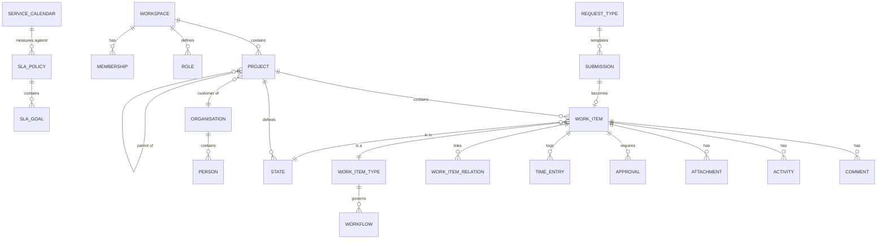

# Data model

PostgreSQL 18, Drizzle ORM, forward-only migrations in `apps/api/drizzle/`.
Schema lives in `apps/api/src/database/schema.ts`.

## Conventions

- Tables singular snake_case (`work_item`), columns snake_case.
- Primary keys are CUID2 text. Never sequential integers on anything user-visible.
- `created_at` / `updated_at` on every table, `timestamptz`, UTC.
- Soft delete only where restore is a real requirement (`archived_at`). Otherwise cascade.
- Money as `numeric(14,4)`. Durations as integer **minutes**. Never floats for either.
- JSONB for genuinely open shapes (plugin config, custom field values, event payloads).
  Never as a way to avoid designing a schema.
- Foreign keys always declared, always with an explicit `ON DELETE`.

## Domains



---

## 1. Instance and configuration

| Table | Purpose |
| --- | --- |
| `instance_setting` | Singleton row: instance name, default locale, timezone, retention |
| `instance_branding` | Product name, logos, colours, login background, support email |
| `instance_plugin_config` | One row per configured plugin instance. `config` jsonb + `secrets` bytea |
| `instance_feature_flag` | `feature_key`, `enabled`, `locked` |
| `terminology_override` | `scope` (`instance`\|`workspace`), `workspace_id` null, `term_key` (enumerated, e.g. `work_item`, `project`, `cycle`), `locale`, `singular`, `plural` |
| `job_lease` | `name`, `owner`, `expires_at` — distributed lock for scheduled jobs |

`terminology_override` is the only table [ADR 0012](adr/0012-terminology-overlay.md)
needs — rendering resolves workspace → instance → the built-in locale string. Marketplace
licensing ([ADR 0013](adr/0013-marketplace-metering-plugin.md)) needs no table of its own:
`license.none` / `license.aws-marketplace` are `instance_plugin_config` rows like any other
plugin.

## 2. Identity and access

better-auth owns `user`, `session`, `account`, `verification`, `two_factor`, `passkey`,
`apikey`. We add:

| Table | Key columns |
| --- | --- |
| `organisation` | `key`, `name`, `is_internal`, `domain[]`, `active` |
| `person` | `user_id`, `organisation_id`, `side` (`staff`\|`customer`), `job_title`, `active` |
| `workspace` | `slug`, `name`, `logo`, `description` |
| `membership` | `person_id`, `scope` (`workspace`\|`project`), `scope_id`, `role_id`, `sees_all`, `inherited_from` |
| `role` | `scope`, `workspace_id`, `key`, `name`, `rank`, `capabilities` jsonb, `is_system`, `is_editable` |
| `team` | `workspace_id`, `name`, `capacity_days_per_week` |
| `team_member` | `team_id`, `person_id`, `allocation_pct` |
| `invitation` | `email`, `organisation_id`, `role_id`, `token_hash`, `expires_at`, `status`, `invited_by` |

`sees_all` on a membership is the explicit reach grant. `inherited_from` records that a
membership came from an ancestor project, per OpenProject's model.

## 3. Projects

| Table | Key columns |
| --- | --- |
| `project` | `workspace_id`, `parent_id`, `key`, `name`, `icon`, `kind` (`project`\|`managed_service`), `organisation_id`, `start_date`, `end_date`, `support_level`, `service_calendar_id`, `default_assignee_id`, `health` (RAG), `archived_at`, `last_work_item_number` |
| `project_feature_flag` | `project_id`, `feature_key`, `enabled` |
| `state` | `project_id`, `name`, `group` (`backlog`\|`unstarted`\|`started`\|`completed`\|`cancelled`), `colour`, `position`, `is_default` |
| `milestone` | `project_id`, `name`, `date`, `reached_at` |
| `prerequisite` | `project_id`, `title`, `owner_side`, `due_date`, `is_blocking`, `completed_at` |
| `stakeholder` | `project_id`, `person_id`, `role`, `escalation_order`, `escalation_wait_minutes`, `active` |
| `document_link` | `project_id`, `url`, `title`, `customer_visible` |

`kind` distinguishes a dated **project** from an indefinite **managed service** — v1's
most useful structural idea. Managed services have a support level and a cover window and
no cycles; projects have dates and a backlog.

`parent_id` gives project hierarchy with role inheritance.

## 4. Work

| Table | Key columns |
| --- | --- |
| `work_item_type` | `workspace_id`, `key`, `name`, `icon`, `category` (`service`\|`delivery`), `workflow_id`, `sla_policy_id`, `is_epic` |
| `work_item` | `project_id`, `type_id`, `number`, `key` (generated), `title`, `description` jsonb (Tiptap), `state_id`, `priority`, `assignee_id`, `requester_id`, `parent_id`, `start_date`, `due_date`, `position`, `estimate_point_id`, `cycle_id`, `module_id`, `resolved_at`, `archived_at` |
| `work_item_relation` | `source_id`, `target_id`, `type` (`relates`\|`blocks`\|`duplicates`\|`precedes`\|`requires`) |
| `watcher` | `work_item_id`, `person_id` |
| `label` | `workspace_id`, `name`, `colour` |
| `work_item_label` | join |
| `comment` | `work_item_id`, `author_id`, `body` jsonb, `visibility` (`public`\|`internal`), `edited_at` |
| `activity` | `work_item_id`, `actor_id`, `verb`, `field`, `old_value`, `new_value`, `payload` jsonb, `visibility`, `created_at` |
| `attachment` | `work_item_id` \| `comment_id`, `object_key`, `filename`, `mime_type`, `size`, `customer_visible`, `uploaded_by` |

**`activity` is the journal.** Every field change writes a row with old and new value.
Point-in-time reconstruction, baselines and the audit trail all derive from it — borrowed
from OpenProject's `Journal`/`Change` design.

`key` is `{project.key}-{number}`, generated by a trigger from
`project.last_work_item_number`. Stable forever; never reused.

## 5. Custom fields

| Table | Key columns |
| --- | --- |
| `custom_field_section` | `workspace_id`, `name`, `position` |
| `custom_field` | `workspace_id`, `section_id`, `key`, `name`, `format`, `options` jsonb, `is_required`, `default_value`, `position` |
| `custom_field_type_visibility` | `custom_field_id`, `work_item_type_id`, `visible`, `required` |
| `custom_field_value` | `custom_field_id`, `entity_type`, `entity_id`, `value` jsonb |

Formats: `text`, `long_text`, `number`, `decimal`, `date`, `datetime`, `boolean`,
`select`, `multi_select`, `user`, `multi_user`, `url`, `email`, `currency`.

Sections plus per-type visibility keep a 30-field instance from rendering a 30-field
form — OpenProject's answer, and a good one.

## 6. Workflow

| Table | Key columns |
| --- | --- |
| `workflow` | `workspace_id`, `key`, `name`, `active_version_id` |
| `workflow_version` | `workflow_id`, `number`, `published_at`, `published_by` |
| `workflow_transition` | `version_id`, `from_state_id`, `to_state_id`, `role_id` (null = all), `note_policy` (`none`\|`optional`\|`required`), `note_visibility`, `requires_approval`, `requires_cab`, `guard` jsonb |

The `role_id` column gives **transition legality per role** — OpenProject's
type × role × status model. A member may move Open → In Progress; only a lead may move
In Progress → Resolved.

Versions are immutable once published. `activity` records which version was active, so
history remains interpretable after a workflow changes.

## 7. Service desk

| Table | Key columns |
| --- | --- |
| `request_type` | `workspace_id`, `key`, `name`, `description`, `icon`, `group`, `work_item_type_id`, `form_schema` jsonb, `sla_policy_id`, `customer_visible`, `position` |
| `request_type_version` | `request_type_id`, `number`, `form_schema`, `effective_from` |
| `submission` | `reference` (`SUB-n`), `organisation_id`, `requester_id`, `request_type_id`, `form_data` jsonb, `status`, `work_item_id`, `created_at` |
| `submission_message` | `submission_id`, `author_id`, `body`, `created_at` |
| `service_calendar` | `workspace_id`, `name`, `timezone`, `windows` jsonb (per weekday), `holidays` jsonb |
| `sla_policy` | `workspace_id`, `name`, `description`, `calendar_id`, `active_version_id` |
| `sla_policy_version` | `policy_id`, `number`, `effective_from` |
| `sla_goal` | `version_id`, `metric` (`first_response`\|`resolution`), `work_item_type_id`, `priority`, `target_minutes` |
| `sla_pause` | `work_item_id`, `started_at`, `ended_at`, `reason` |
| `approval` | `work_item_id`, `kind` (`customer`\|`cab`), `requested_by`, `approver_id`, `status`, `expires_at`, `decided_at`, `decision_note` |

**SLA state is never stored.** It is computed on read from
`created_at + goal.target_minutes` evaluated against the service calendar, minus paused
intervals. Inherited from v1 and correct: no timers to drift, no backfill after a policy
change, no reconciliation job.

`sla_pause` exists because "waiting on customer" must not consume the clock.

## 8. Agile

| Table | Key columns |
| --- | --- |
| `cycle` | `project_id`, `name`, `start_date`, `end_date`, `status` |
| `module` | `project_id`, `name`, `lead_id`, `status`, `target_date` |
| `estimate` | `project_id`, `system` (`points`\|`categories`\|`time`), `active` |
| `estimate_point` | `estimate_id`, `key`, `value`, `position` |

## 9. Time and cost

| Table | Key columns |
| --- | --- |
| `time_entry` | `work_item_id`, `person_id`, `date`, `minutes`, `activity_id`, `description`, `billable` |
| `time_activity` | `workspace_id`, `name` |
| `hourly_rate` | `person_id`, `project_id` (null = default), `rate`, `currency`, `effective_from` |
| `cost_type` | `workspace_id`, `name`, `unit`, `default_rate` |
| `cost_entry` | `work_item_id`, `cost_type_id`, `person_id`, `date`, `units`, `rate`, `description` |
| `budget` | `project_id`, `name`, `planned_amount`, `currency`, `period_start`, `period_end` |
| `available_hours` | `person_id`, `period_start`, `period_end`, `hours` |

Rates are **effective-dated**, so historic entries keep the rate that applied when they
were logged. OpenProject's model; the alternative silently rewrites history.

## 10. Knowledge and service management

| Table | Key columns |
| --- | --- |
| `kb_article` | `workspace_id`, `project_id`, `title`, `body` jsonb, `status`, `customer_visible`, `author_id`, `published_at` |
| `kb_article_version` | `article_id`, `number`, `body`, `created_by`, `created_at` |
| `kb_category` | `workspace_id`, `name`, `parent_id` |
| `service` | `workspace_id`, `name`, `description`, `category`, `owner_team_id`, `support_level` |
| `change_detail` | `work_item_id`, `risk`, `window_start`, `window_end`, `rollback_plan`, `freeze_override` |
| `change_freeze` | `workspace_id`, `starts_at`, `ends_at`, `reason` |
| `release` | `workspace_id`, `service_id`, `name`, `planned_at`, `status`, `notes` |

## 11. Notifications, integrations, audit

| Table | Key columns |
| --- | --- |
| `notification` | `person_id`, `kind`, `title`, `body`, `resource_type`, `resource_id`, `read_at` |
| `notification_preference` | `person_id`, `channel`, `event_kind`, `enabled` |
| `outbox` | `event_id`, `kind`, `payload` jsonb, `status`, `attempts`, `next_attempt_at`, `last_error` |
| `webhook` | `workspace_id`, `url`, `secret` (encrypted), `events` text[], `active` |
| `webhook_delivery` | `webhook_id`, `event_id`, `status_code`, `duration_ms`, `error`, `attempted_at` |
| `external_link` | `work_item_id`, `system`, `external_id`, `url`, `title` |
| `audit_log` | `actor_id`, `actor_ip`, `action`, `entity_type`, `entity_id`, `before` jsonb, `after` jsonb, `created_at` |
| `saved_view` | `owner_id`, `scope`, `scope_id`, `name`, `query` jsonb, `shared_with_team_id`, `layout` |
| `import_run` | `plugin_id`, `started_by`, `status`, `source_ref`, `stats` jsonb, `log` jsonb |
| `import_mapping` | `import_run_id`, `source_type`, `source_id`, `target_type`, `target_id` |

`outbox` is the reliability mechanism for webhooks and notifications: a mutation writes
the outbox row in the same transaction as the change, and a scheduled job drains it with
retry and exponential backoff. This is what v1's fire-and-forget webhooks lacked.

`import_mapping` makes imports **idempotent and re-runnable** — re-importing does not
duplicate.

## Indexing

Non-obvious indexes that matter:

```sql
create index on work_item (project_id, state_id, position);
create index on work_item (assignee_id) where archived_at is null;
create index on work_item (due_date) where resolved_at is null;
create unique index on work_item (project_id, number);
create index on activity (work_item_id, created_at desc);
create index on comment (work_item_id, created_at);
create index on membership (person_id, scope, scope_id);
create index on custom_field_value (entity_type, entity_id);
create index on outbox (status, next_attempt_at) where status = 'pending';
create index on audit_log (entity_type, entity_id, created_at desc);

-- full-text search
alter table work_item add column search_vector tsvector
  generated always as (
    setweight(to_tsvector('english', coalesce(title,'')), 'A') ||
    setweight(to_tsvector('english', coalesce(description->>'text','')), 'B')
  ) stored;
create index on work_item using gin (search_vector);
```

## Migrations

- Generated with `drizzle-kit generate`, reviewed by a human, committed.
- **Forward-only.** No down migrations. To undo, write a new migration.
- Applied automatically at container start, guarded by an advisory lock so concurrent
  replicas do not race.
- Destructive changes are two-phase: add the new column and dual-write, backfill, switch
  reads, then drop in a later release.

## Retention

| Data | Default | Configurable |
| --- | --- | --- |
| `audit_log` | 12 months | Yes, God Mode |
| `activity` | Forever | No — it is the journal |
| `notification` | 90 days once read | Yes |
| `webhook_delivery` | 30 days | Yes |
| `session` | On expiry | Yes |
| Soft-deleted work items | 30 days, then purged | Yes |

## Related

- [Architecture overview](overview.md) · [RBAC](rbac.md) · [Multi-tenancy](multi-tenancy.md)
- Feature specs in [03-features](../03-features/README.md)
