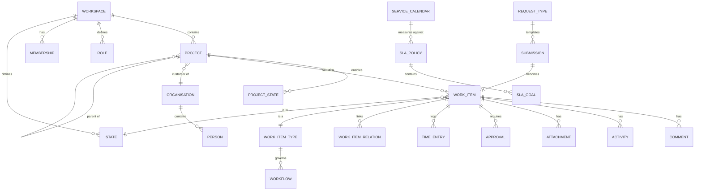

# Data model

PostgreSQL 18, Drizzle ORM, forward-only migrations in `apps/api/drizzle/`.
Schema lives in `apps/api/src/database/schema.ts`.

> **This document is authoritative for every table and column.** A feature spec that
> needs a column names it here first; a spec that names a table not defined here is wrong,
> not the schema. Rewritten 2026-09-05 after the [planning review](../07-planning/review-2026-09-05.md)
> found eight referenced tables and two dozen referenced columns that did not exist.

## Conventions

- Tables singular snake_case (`work_item`), columns snake_case.
- Primary keys are CUID2 text. Primary keys and surrogate ids are **never** sequential.
  The two human-facing counters are deliberate exceptions and neither is a primary key:
  `work_item.number` (per project, rendered `{project.key}-{number}`) and
  `submission.number` (per instance, rendered `SUB-n`).
- `created_at` / `updated_at` on every table, `timestamptz`, UTC. **One exception:**
  `job_lease` is a lock, not data — it carries neither, and the acquire's
  `on conflict do update` sets neither.
- **Lifecycle position is always a column named `state`, never `status`** — see the
  [glossary](../00-overview/glossary.md). This applies to every table below.
- Soft delete via `deleted_at` where a restore window is a requirement; `archived_at` is a
  *separate* concept (hidden but live) and the two never share a column. Otherwise cascade.
- Optimistic concurrency via `version integer not null default 1` on every table two people
  plausibly edit at once — see [api-design.md](api-design.md). Marked **v** below.
- Money as `numeric(14,4)`. Durations as integer **minutes**. Never floats for either.
- JSONB for genuinely open shapes (plugin config, custom field values, event payloads).
  Never as a way to avoid designing a schema. Every JSONB column below names the document
  that owns its shape.
- Foreign keys always declared, always with an explicit `ON DELETE`. **Exception:**
  polymorphic references (`custom_field_value`, `attachment`, `external_link`,
  `audit_log`) carry an `entity_type` + `entity_id` pair or mutually exclusive nullable
  FKs with a `CHECK` that exactly one is set, and the owning entity's delete path cleans
  them up.
- `actor_type` accompanies every `actor_id`: `person | automation | system | api_key` —
  see [events.md](events.md). An automation, a scheduled job and an API key are
  distinguishable from a person everywhere an actor is recorded.
- Enumerations are Postgres enums or `CHECK` constraints, never free text. **Priority** is
  the ordered enum `low < medium < high < urgent` — ordering is load-bearing for the
  customer escalate-only rule and for every importer's mapping.

## Domains



---

## 1. Instance and configuration

| Table | Purpose |
| --- | --- |
| `instance_setting` | Singleton row: `setup_completed_at` (the durable first-run marker — [auth-and-identity.md](auth-and-identity.md)), instance name, default locale, timezone, retention periods, support email, terms/privacy URLs, session idle/absolute defaults and maxima, `reopen_window_days` (default 14), `clarification_window_days` (default 14), `attachment_max_bytes`, `attachment_max_per_item`, `attachment_allowed_extensions text[]`, `mcp_write_ceiling_per_minute`, `api_key_burst_threshold`, health thresholds |
| `instance_branding` | Product name, logos (light/dark), favicon, accent colour, login background, footer links, `css_overrides jsonb` — **bounded** to the enumerated variable set in [design-system.md](../02-design/design-system.md), validated server-side |
| `instance_plugin_config` | One row per configured plugin instance. Full columns: `plugin_id`, `instance_key`, `display_name`, `enabled`, `config jsonb`, `secrets bytea` (AES-256-GCM, envelope prefixed with `key_id`), `scope` (`instance`\|`workspace`), `workspace_id` null, `portal_scope` (`agent`\|`customer`\|`both`, auth plugins), `config_version integer`, `updated_by`. **v.** Shape per [plugin-architecture.md](plugin-architecture.md) |
| `instance_feature_flag` | `feature_key`, `enabled`, `locked`. The flag key enumeration lives in [plugin-architecture.md](plugin-architecture.md) and nowhere else |
| `terminology_override` | `scope` (`instance`\|`workspace`), `workspace_id` null, `audience` (`agent`\|`customer`\|`both`, default `both`), `term_key` (enumerated in [ADR 0012](adr/0012-terminology-overlay.md)), `locale`, `forms jsonb` — CLDR plural categories (`one`, `other`, and `zero/two/few/many` where the locale has them), replacing a naive singular/plural pair. Unique on `(scope, workspace_id, audience, term_key, locale)` |
| `job_lease` | `name pk`, `owner` (`hostname:pid:bootId`), `expires_at` — the distributed lock for scheduled jobs. **Inherited from kaneo**, which defines the table (`apps/api/src/database/schema.ts`) and ships the acquire and release SQL (`apps/api/src/scheduler/leader-lock.ts`); the heartbeat/renew and the abort `signal` are ours. A lock, not data — deliberately no `created_at`/`updated_at`. See [background-jobs.md](background-jobs.md) for the exact acquire/renew/release SQL |
| `idempotency_key` | `actor_id`, `actor_type`, `key`, `route`, `request_hash`, `response_status`, `response_body jsonb`, `state` (`in_flight`\|`done`), `created_at`, `expires_at`. Unique `(actor_id, key)`. An in-flight duplicate returns `409` |
| `backup_run` | `started_at`, `finished_at`, `kind` (`database`\|`objects`\|`wal`), `bytes`, `outcome`, `notes`. Written by `scripts/backup.sh`; read by God Mode → Health for the "no backup in 48 h" warning |

Marketplace licensing ([ADR 0013](adr/0013-marketplace-metering-plugin.md)) needs no table
of its own: `license.none` / `license.aws-marketplace` are `instance_plugin_config` rows.

## 2. Identity and access
**One person, one organisation; email is not a key.** `person.organisation_id` is fixed at
creation and never changes. The identity key is `(identity_connection_id, subject)` on
`external_identity`, so **better-auth's default unique index on `user.email` is dropped at
fork** — two `person` rows in different organisations may carry the same address, which is
how one human can be both a staff member and a customer contact without the two ever being
linked (`IP-18`, [multi-tenancy.md](multi-tenancy.md#identity-across-tenants)). Anything
that needs "this human, everywhere" does not exist by design.

better-auth owns `user`, `session`, `account`, `verification`, `two_factor`, `passkey`,
`apikey`. better-auth is used for **authentication only** — its organisation plugin is
**not** used; the directory below is ours. We add, via better-auth's `additionalFields`,
`session.portal` (`agent`\|`customer`), set at issue time and compared to the request host
by the portal-boundary middleware ([auth-and-identity.md](auth-and-identity.md)).

| Table | Key columns |
| --- | --- |
| `organisation` | `key`, `name`, `is_internal`, `domain[]`, `active`, `portal_access boolean not null default true` (false closes the customer portal to this organisation's people — sign-in is refused and live sessions are revoked; distinct from `active`, which deactivates the organisation entirely), `deleted_at`, `purge_after`, `default_customer_visibility` (`private`\|`organisation`, default `organisation`) |
| `organisation_quota` | `organisation_id` **unique**, `max_projects` (default 200), `max_work_items` (default 500 000), `max_storage_bytes` (default 20 GiB), `max_portal_users` (default 500), `max_api_requests_per_minute` (default 600), `max_webhooks` (default 10), `updated_by`. The six limits of [multi-tenancy.md](multi-tenancy.md); no row means the defaults. **Current usage is never stored here** — projects, work items and portal people are counted live off their own indexes, storage is `sum(attachment.size)` over `attachment.organisation_id`, API requests come from the rate limiter's window, webhooks are counted off `webhook`. Exceeding a limit returns `429` |
| `person` | `user_id` **nullable**, `organisation_id`, `side` (`staff`\|`customer`), `job_title`, `active`, `is_placeholder` (import-created, no login; can author history, can never be assigned or hold a membership; claimed — not duplicated — when that email later signs in), `locale`, `quiet_hours_start`, `quiet_hours_end`, `quiet_hours_timezone` |
| `workspace` | `slug`, `name`, `logo`, `description`, `default_sla_policy_id` null, `time_entry_backdate_limit_days` (default 30), `kb_review_step_enabled`, `deleted_at`, `purge_after` — the same 30-day recovery window as `organisation`, so a workspace delete does not bypass the windows its `project` and `work_item` children carry |
| `workspace_feature_flag` | `workspace_id`, `feature_key`, `enabled`. Unique `(workspace_id, feature_key)`. The middle level of the flag resolution `project → workspace → instance → default` |
| `membership` | `person_id`, `scope` (`organisation`\|`workspace`\|`project`), `scope_id`, `role_id`, `sees_all`, `inherited_from`, `derived_from` null (`scim_group_member.id` when SCIM group sync created it). An `organisation`-scoped membership is how a **customer-side** person holds the `customer` role on their organisation — created by invitation, JIT or SCIM; a staff person never holds one |
| `role` | `scope` (`instance`\|`organisation`\|`workspace`\|`project` — `organisation` exists for exactly one system role, `customer`), `workspace_id`, `key` (server-generated kebab slug, unique per `(scope, workspace_id)`, immutable), `name`, `description`, `rank`, `capabilities jsonb` (string[]), `is_system`, `is_editable`. **v** |
| `team` | `workspace_id`, `name`, `capacity_days_per_week`, `is_cab` (exactly this team's members may decide CAB approvals) |
| `team_member` | `team_id`, `person_id`, `allocation_pct`, `is_lead` |
| `invitation` | `email`, `organisation_id`, `role_id`, `token_hash`, `expires_at`, `state`, `invited_by` |
| `api_key` | Extension of better-auth's `apikey`: `apikey_id`, `workspace_id` null, `person_id` null (`CHECK` exactly one set — a workspace key is a service key with no person), `capabilities jsonb` (a service key's set is bounded by its creator's expanded authority at creation), `ip_allowlist inet[]`, `rate_limit_per_minute`, `expires_at`, `last_used_at`, `last_used_ip`, `prefix`, `is_mcp`, `disabled_at`, `disabled_reason`. **`CHECK (NOT is_mcp OR person_id IS NOT NULL)`** — an MCP key is always a personal key owned by a named human; service keys are never MCP keys ([mcp-server.md](../03-features/mcp-server.md)) |
| `user_preference` | `person_id`, `scope` (`global`\|`workspace`\|`project`), `scope_id` null, `key`, `value jsonb`. The per-user UI store: layout per project, density, chosen columns, column widths, collapsed groups, pinned views, drafts. Unique `(person_id, scope, scope_id, key)` |
| `legal_hold` | `scope` (`organisation`\|`person`), `scope_id`, `placed_by`, `placed_at`, `reason`, `lifted_by` null, `lifted_at` null. An **open** row (`lifted_at is null`) suspends `audit-purge`, the soft-delete purge in `session-cleanup`, `attachment-gc` and every hard delete for that scope — [security-model.md](security-model.md), [background-jobs.md](background-jobs.md), [data-protection.md](../05-operations/data-protection.md). Placing and lifting write `legal_hold.placed` / `legal_hold.lifted` audit rows. Partial unique index `(scope, scope_id) where lifted_at is null` — at most one open hold per scope |

`sees_all` on a membership is the explicit reach grant. `inherited_from` records that a
membership came from an ancestor project, per OpenProject's model.

### External identity — OIDC connections and SCIM provisioning

Decided 2026-09-05: Microsoft Entra OIDC and SCIM are **core P3 delivery**
([identity-provisioning.md](../03-features/identity-provisioning.md)). OIDC connections
have typed rows here rather than generic `instance_plugin_config` rows because the
organisation FK and the SCIM link cannot live in `config jsonb`; non-OIDC auth plugins
(`auth.password`, `auth.email-otp`, `auth.magic-link`) stay in `instance_plugin_config`.

| Table | Key columns |
| --- | --- |
| `identity_connection` | `provider_type` (`entra` now; `okta`\|`keycloak`\|`generic_oidc` reserved), `portal_scope` (`agent`\|`customer` — **never both**), `organisation_id` null (**`CHECK` set iff `portal_scope = 'customer'`**), `display_name`, `issuer`, `tenant_id` null, `client_id`, `client_secret bytea` (same envelope as plugin secrets), `redirect_uri`, `scopes text[]`, `claim_mapping jsonb`, `domain_bindings text[]` (each domain bound to exactly one connection — unique across rows), `jit_policy jsonb` (`enabled`, default role), **`max_role_rank`** (the one ceiling for everything this connection may grant — JIT default role, group mappings; null on customer connections, whose only role is `customer`), `mfa_upstream_mode` (`claim`\|`static`\|`off`), `enabled`, `config_version`, `health_state`, `health_checked_at`, `created_by`, `updated_by`. **v.** Unique `(organisation_id)` where not null — one active customer connection per organisation in the first release |
| `scim_connection` | `identity_connection_id` **unique**, `token_hash`, `token_prefix`, `token_created_at`, `token_rotated_at`, `allowed_resources text[]` (`users`, `groups`), `attribute_mapping jsonb`, `lifecycle_policy` (`end_memberships`\|`keep_memberships`, default `end_memberships`), `enabled`, `last_sync_at`, `last_sync_outcome`, `last_failure jsonb` (never secrets). Rotation replaces `token_hash` — **no previous-token grace column, by decision** |
| `external_identity` | `identity_connection_id`, `person_id`, `user_id` null (null until first login), `issuer`, `subject` (immutable — Entra `oid`), `scim_external_id` null, `user_name_snapshot`, `email_snapshot`, `active`, `provisioned_via` (`jit`\|`scim`\|`invite`), `first_seen_at`, `last_login_at`, `deactivated_at`. Unique `(identity_connection_id, subject)`; unique `(identity_connection_id, scim_external_id)` where not null. **Email is an attribute, never the key** |
| `scim_group_mapping` | `scim_connection_id`, `external_group_id`, `external_group_name_snapshot`, `role_id` (an **existing** role; never a role granting `instance:*`, never `sees_all`), `scope` (`organisation`\|`workspace`), `scope_id`, `enabled`, `created_by`. Unique `(scim_connection_id, external_group_id)`. `CHECK`: a customer connection's mapping targets a customer role only |
| `scim_group_member` | `scim_group_mapping_id`, `external_identity_id`, `membership_id` (the membership this mapping derived — removed symmetrically when the group membership goes) |
| `provisioning_event` | `identity_connection_id`, `scim_connection_id` null, `external_identity_id` null, `kind` (`user.created`\|`user.updated`\|`user.deactivated`\|`user.reactivated`\|`group.mapping_changed`\|`group.member_added`\|`group.member_removed`\|`request.denied`\|`auth.failed`\|`token.rotated`\|`token.revoked`\|`connection.changed`\|`sync.failed`), `outcome`, `detail jsonb` (structured, **never secrets, never raw tokens**), `actor_type`, `trace_id`, `created_at`. The provisioning ledger; events that change authority, reach or configuration also write `audit_log` |

## 3. Projects and states

| Table | Key columns |
| --- | --- |
| `project` | `workspace_id`, `parent_id`, `key` (**unique per instance**), `name`, `icon` (a lucide icon name from the checked-in allowlist), `kind` (`project`\|`managed_service`), `organisation_id` **nullable** (null = internal), `manager_id` → `person` (the "exactly one project manager" of `PR-6`), `owner_team_id` null (reach step 5 in [rbac.md](rbac.md)), `start_date`, `end_date`, `support_level`, `service_calendar_id`, `sla_policy_id` null, `default_assignee_id`, `default_billable` (default true), `default_comment_visibility` (`internal`), `cycle_rollover_policy`, `health` (RAG), `archived_at`, `deleted_at`, `last_work_item_number`. **v** |
| `project_feature_flag` | `project_id`, `feature_key`, `enabled` |
| `state` | **Workspace-scoped**: `workspace_id`, `key`, `name`, `group` (`backlog`\|`unstarted`\|`started`\|`completed`\|`cancelled`), `colour`, `archived_at` — hidden from pickers, still referenceable. Archiving is what "removing a state" ([ADR 0011](adr/0011-ticket-lifecycle-engine.md)) does; a state with `work_item` or `activity` rows pointing at it is never deleted. The five `group` values are the only fixed lifecycle vocabulary — [ADR 0011](adr/0011-ticket-lifecycle-engine.md). `group` is a SQL reserved word and is written `"group"` in the DDL |
| `project_state` | `project_id`, `state_id`, `position`, `is_default`, `enabled`. Which workspace states a project uses, in what order, and which is the default for new work items. A project's "own states" (`PR-17`) are its rows here, seeded from the workspace's default set at creation |
| `milestone` | `project_id`, `name`, `date`, `reached_at` |
| `prerequisite` | `project_id`, `title`, `owner_side`, `due_date`, `is_blocking`, `completed_at` |
| `stakeholder` | `project_id`, `person_id`, `role`, `escalation_order`, `escalation_wait_minutes`, `active` |
| `document_link` | `project_id`, `url`, `title`, `customer_visible` |

**Why states moved to the workspace (2026-09-05).** Workflows and work item types are
workspace-scoped; transitions reference states. With project-scoped states a workspace
workflow could serve exactly one project — the review found this made
[ADR 0011](adr/0011-ticket-lifecycle-engine.md)'s "one lifecycle engine" unbuildable.
States are now workspace rows; `project_state` gives each project its ordering, default
and enabled subset, which is what "each project has its own states" actually meant. A
workflow validation error is raised when a project enables a state its workflow has no
transitions for (`WF-9`).

`kind` distinguishes a dated **project** from an indefinite **managed service** — v1's
most useful structural idea. Managed services have a support level and a cover window and
no cycles; projects have dates and a backlog.

## 4. Work

| Table | Key columns |
| --- | --- |
| `work_item_type` | `workspace_id`, `key`, `name`, `icon`, `category` (`service`\|`delivery`), `workflow_id`, `sla_policy_id`, `is_epic`, `is_change` (drives CAB rules — never matched by type name) |
| `work_item` | `project_id`, `type_id`, `number`, `key` (**stored**, set once at insert from `{project.key}-{number}`; never regenerated), `title`, `description jsonb` (Tiptap), `state_id` (**`ON DELETE RESTRICT`** — states are archived, never deleted out from under an item), `priority`, `assignee_id` (`ON DELETE RESTRICT` — people are deactivated, never deleted), `requester_id`, `parent_id`, `service_id` null, `start_date`, `due_date`, `position numeric(20,10)`, `estimate_point_id`, `cycle_id`, `module_id`, `sla_started_at` (copied from `submission.created_at` on acceptance; otherwise `created_at`), `first_response_at timestamptz null` (set once, by the first `comment` with `visibility = 'public'` whose author is a `side = 'staff'` person — the stored fact the `first_response` SLA metric is computed from, `SLA-7`), `resolved_at`, `customer_visibility` (`private`\|`organisation`), `archived_at`, `deleted_at`. **v** |
| `work_item_key_alias` | `old_key`, `work_item_id` — a cross-project move re-keys the item and the old key redirects |
| `work_item_template` | `workspace_id`, `type_id`, `name`, `title`, `description jsonb`, `labels jsonb`, `custom_field_values jsonb`, `checklist_template_id` null, `recurrence jsonb` null (a recurrence rule; the scheduler instantiates — see [review](../07-planning/review-2026-09-05.md)) |
| `checklist_template` / `checklist_item` | `checklist_template (workspace_id, name)`; `checklist_item (work_item_id \| release_id \| template_id, position, text, done_at, done_by)` — one checklist model shared by work items (`WI-5`) and releases (`REL-3`) |
| `work_item_relation` | `source_id`, `target_id`, `type` (`relates`\|`blocks`\|`duplicates`\|`precedes`\|`requires`) |
| `watcher` | `work_item_id`, `person_id`, `source` (`explicit`\|`implicit`), `muted` |
| `label` | `workspace_id`, `project_id` null (null = workspace label), `name`, `colour` |
| `work_item_label` | join |
| `comment` | `work_item_id`, `author_id`, `actor_type`, `body jsonb`, `visibility` (`public`\|`internal`), `activity_id` null (links a transition note to its transition), `edited_at`, `deleted_at` null, `deleted_by` null — the tombstone `CA-18` renders ("Comment deleted by Jane, 2 March"): the row, its author and its position survive, the body is not rendered, and the row is purged with the 30-day soft-delete sweep. **v** |
| `comment_version` | `comment_id`, `number`, `body jsonb`, `edited_by`, `created_at` — the edit history `CA-17` renders |
| `canned_response` | `workspace_id`, `name`, `body jsonb`, `visibility_default`, `created_by` |
| `activity` | `work_item_id`, `actor_id`, `actor_type`, `verb`, `field`, `old_value`, `new_value`, `payload jsonb`, `visibility` (`public`\|`internal` — the verb→visibility table in [comments-and-activity.md](../03-features/comments-and-activity.md); unmapped verbs are `internal`), `workflow_version_id` null, `created_at` |
| `attachment` | `workspace_id` **not null**, `organisation_id` null (null = internal) — both denormalised at insert, because the object-key template ([storage-and-attachments.md](storage-and-attachments.md)) is built from the workspace, the per-organisation storage quota sums on the organisation, and `attachment-gc` needs both to honour an open `legal_hold`; a `submission_id` row reaches its workspace only through a two-hop join, which is why these are stored rather than derived. `work_item_id` \| `comment_id` \| `submission_id` (`CHECK` exactly one), `object_key`, `filename`, `mime_type`, `size`, `state` (`pending`\|`ready`\|`deleted`), `customer_visible`, `uploaded_by`, `deleted_at`. Partial index on `state = 'pending'` for the hourly cleanup |

**`activity` is the journal.** Every field change writes a row with old and new value.
Point-in-time reconstruction, baselines and the audit trail all derive from it — borrowed
from OpenProject's `Journal`/`Change` design.

**"Open" and "closed"**, wherever a spec uses the words: closed ⇔
`state.group in ('completed', 'cancelled')`; open ⇔ anything else. Never a state name.

## 5. Custom fields

| Table | Key columns |
| --- | --- |
| `custom_field_section` | `workspace_id`, `name`, `position` |
| `custom_field` | `workspace_id`, `section_id`, `entity_type` (`work_item` in P4; `project`, `person`, `time_entry`, `cycle` later), `key`, `name`, `format`, `options jsonb`, `is_required`, `default_value`, `help_text`, `customer_visible`, `visibility_condition jsonb` null (single-level: `{ field_key, op: eq\|neq\|in\|is_set, value }`), `position`, `deleted_at` (soft-deleted, restorable 30 days — the convention above; there is no `archived_at` here, because "hidden but live" is not a custom-field state we offer) |
| `custom_field_type_visibility` | `custom_field_id`, `work_item_type_id`, `visible`, `required` — applies only when `entity_type = 'work_item'` |
| `custom_field_value` | `custom_field_id`, `entity_type`, `entity_id`, `value jsonb`, `project_id` null, `organisation_id` null — the last two denormalised at insert from the parent entity, so this polymorphic table can be reach-filtered ([multi-tenancy.md](multi-tenancy.md), [rbac.md](rbac.md)) without a per-`entity_type` join |

Formats: `text`, `long_text`, `number`, `decimal`, `date`, `datetime`, `boolean`,
`select`, `multi_select`, `user`, `multi_user`, `url`, `email`, `currency`.

## 6. Workflow — the lifecycle engine

| Table | Key columns |
| --- | --- |
| `workflow` | `workspace_id`, `key`, `name`, `active_version_id`. **v** |
| `workflow_version` | `workflow_id`, `number`, `published_at`, `published_by` |
| `workflow_transition` | `version_id`, `from_state_id` **nullable** (null = from any state, `WF-5`), `to_state_id`, `role_id` (null = all), `note_policy` (`none`\|`optional`\|`required`), `note_visibility`, `requires_approval`, `approval_policy` (`any`\|`all`), `requires_cab`, `is_reopen boolean not null default false` (**at most one per workflow version** — partial unique index `(version_id) where is_reopen`; this is "the" reopen transition `WF-21` and `CP-8` resolve), `guards jsonb`, `effects jsonb` |
| `scheduled_transition` | `work_item_id`, `transition_id`, `from_state_id` (the state the item was in when the effect fired — the row is cancelled if the item has since left it), `to_state_id`, `due_at`, `state` (`pending`\|`fired`\|`cancelled`), `created_at`. Written by the `schedule_transition` effect below; scanned and fired by `reminder-scan` ([background-jobs.md](background-jobs.md)). Index on `(due_at) where state = 'pending'` |

`guards` and `effects` are arrays drawn from **closed vocabularies owned by
[workflows.md](../03-features/workflows.md)**:

- guards — `children_closed`, `no_open_blockers`, `assignee_present`,
  `field_required { field }` (native or `cf.<key>` or a satellite such as
  `change.rollback_plan`), `change_risk_at_most { level }`; each has a reason code
  `guard.<type>` returned in the problem detail (`WF-16`).
- effects — `set_assignee { personId | 'default' }`, `clear_assignee`, `pause_sla`,
  `resume_sla`, `set_field { field, value }`, `schedule_transition { after_minutes,
  to_state_id }` (the "pending until" pattern — writes a `scheduled_transition` row with
  `due_at = now() + after_minutes` and the current state as `from_state_id`; the row is the
  only record of the pending transition, and `reminder-scan` is what fires it). Entering a `completed`-group state writes
  an `sla_pause` row with reason `resolved`; leaving it closes that row — which is how
  `WF-18` "resumes rather than restarts" is implemented against a never-stored SLA state.

The `role_id` column gives **transition legality per role** — OpenProject's
type × role × status model. Versions are immutable once published; `activity` records
which version was active, so history remains interpretable after a workflow changes.

## 7. Service desk

| Table | Key columns |
| --- | --- |
| `request_type` | `workspace_id`, `key`, `name`, `description`, `icon`, `group`, `work_item_type_id`, `form_schema jsonb` (shape incl. `showIf` in [request-types-and-catalogue.md](../03-features/request-types-and-catalogue.md)), `sla_policy_id`, `default_assignee_id`, `auto_accept`, `customer_visible`, `force_private`, `position`. **v** |
| `request_type_version` | `request_type_id`, `number`, `form_schema`, `effective_from` |
| `organisation_request_type` | `organisation_id`, `request_type_id` — the per-organisation catalogue. **No row ⇒ not visible and not submittable** |
| `submission` | `number` (from an instance-wide sequence, never reused; rendered `SUB-n`), `organisation_id`, `requester_id`, `request_type_id`, `request_type_version_id`, `form_data jsonb`, `state` (`new`\|`clarifying`\|`accepted`\|`declined`\|`duplicate`\|`withdrawn`), `claimed_by`, `claimed_at`, `customer_visibility`, `work_item_id`, `created_at` |
| `submission_message` | `submission_id`, `author_id`, `actor_type`, `body`, `created_at` |
| `deflection_event` | `person_id`, `request_type_id`, `kb_article_id`, `query`, `abandoned_at` null |
| `service_calendar` | `workspace_id`, `name`, `timezone`, `windows jsonb` (per weekday, minutes-from-midnight `0..1440`), `holidays jsonb` (dated, ranged, or `{ recurs: 'annually', month, day, name }` — expanded at read) |
| `sla_policy` | `workspace_id`, `name`, `description`, `calendar_id`, `at_risk_threshold_pct` (default 75), `active_version_id`. **v** |
| `sla_policy_version` | `policy_id`, `number`, `effective_from` |
| `sla_goal` | `version_id`, `metric` (`first_response`\|`resolution`), `work_item_type_id`, `priority`, `target_minutes` |
| `sla_pause` | `work_item_id`, `metric`, `started_at`, `ended_at`, `reason` (`waiting_customer`\|`resolved`\|`manual`\|…). At most one open row per `(work_item_id, metric)` — `unique (work_item_id, metric) where ended_at is null`. There is no `kind` column; `reason` says why, and the open row is identified by the metric alone |
| `work_item_sla_cache` | `work_item_id`, `metric`, `state` (`none`\|`ok`\|`at_risk`\|`breached`\|`met`\|`missed` — snake_case; the six values of [sla.md](../03-features/sla.md) and nowhere else), `due_at`, `computed_at`. **A cache for edge detection and list filtering only** — the detail endpoint always recomputes; where they disagree the computed value wins ([ADR 0009](adr/0009-lazy-sla-evaluation.md)) |
| `approval` | `work_item_id`, `transition_id` (the gate it satisfies), `kind` (`customer`\|`cab`), `requested_by`, `approver_id`, `state` (`pending`\|`approved`\|`rejected`\|`expired`\|`withdrawn`), `expires_at`, `reminder_50_sent_at`, `reminder_90_sent_at`, `decided_at`, `decision_note` |
| `satisfaction_rating` | `work_item_id`, `person_id`, `score`, `comment`, `created_at`, `updated_at`. Unique `(work_item_id, person_id)` |
| `request_participant` | `work_item_id` null \| `submission_id` null (`CHECK` exactly one), `person_id`, `added_by` — a customer's colleagues CC'd on a request; participants are in reach for a `private` request |

**Authoritative SLA state is never stored.** It is computed on read from
`sla_started_at + goal.target_minutes` evaluated against the service calendar, minus
paused intervals. The cache above exists so lists can filter and `sla-scan` can detect
edges without recomputing every item.

## 8. Agile

| Table | Key columns |
| --- | --- |
| `cycle` | `project_id`, `name`, `start_date`, `end_date`, `state` (`upcoming` and `active` derived from dates; `completed` set by the completion action) |
| `cycle_snapshot` | `cycle_id`, `date`, `scope_points`, `completed_points`, `item_count` — written daily by `metrics-snapshot`; the burndown and velocity source |
| `module` | `project_id`, `name`, `lead_id`, `state`, `target_date` |
| `estimate` | `project_id`, `system` (`points`\|`categories`\|`time`), `active` |
| `estimate_point` | `estimate_id`, `key`, `value`, `position` |

## 9. Time and cost

| Table | Key columns |
| --- | --- |
| `time_entry` | `work_item_id`, `person_id`, `date`, `minutes`, `activity_id`, `description`, `billable` |
| `running_timer` | `person_id pk`, `work_item_id`, `started_at`, `activity_id`, `description` — one per person; capped at 12 h by the `stop` handler and a sweeper |
| `time_activity` | `workspace_id`, `name` |
| `hourly_rate` | `person_id`, `project_id` (null = default), `rate`, `currency`, `effective_from` |
| `cost_type` | `workspace_id`, `name`, `unit`, `default_rate`, `currency` |
| `cost_entry` | `work_item_id` null \| `project_id` null (`CHECK` exactly one), `cost_type_id`, `person_id`, `date`, `units`, `rate`, `currency`, `description` |
| `budget` | `project_id`, `name`, `planned_amount`, `currency`, `period_start`, `period_end` |
| `available_hours` | `person_id`, `period_start`, `period_end`, `hours` |

Rates are **effective-dated**, so historic entries keep the rate that applied when they
were logged. OpenProject's model; the alternative silently rewrites history.

## 10. Knowledge and service management

| Table | Key columns |
| --- | --- |
| `kb_article` | `workspace_id`, `project_id`, `title`, `body jsonb`, `state` (`draft`\|`in_review`\|`published`\|`archived`), `customer_visible`, `author_id`, `owner_id`, `review_due_at`, `view_count` (batched increment), `published_at`. **v** |
| `kb_article_version` | `article_id`, `number`, `body`, `created_by`, `created_at` |
| `kb_article_feedback` | `article_id`, `person_id`, `helpful`, `comment` |
| `kb_category` | `workspace_id`, `name`, `parent_id` |
| `service` | `workspace_id`, `name`, `description`, `category`, `owner_team_id`, `support_level`, `service_calendar_id`, `state` (`operational`\|`degraded`\|`outage`, set by a person) |
| `service_dependency` | `service_id`, `depends_on_service_id` — the impact graph; cycles permitted and flagged |
| `change_detail` | `work_item_id`, `risk`, `window_start`, `window_end`, `rollback_plan`, `freeze_override`, `release_id` null |
| `change_service` | `work_item_id`, `service_id` — the affected services of a change |
| `change_freeze` | `workspace_id`, `starts_at`, `ends_at`, `reason` |
| `release` | `workspace_id`, `service_id`, `name`, `planned_at`, `state`, `notes`, `customer_visible` |

## 11. Automations, notifications, integrations, audit

| Table | Key columns |
| --- | --- |
| `automation` | `workspace_id`, `project_id` null (null = workspace rule), `project_filter jsonb` null, `name`, `enabled`, `trigger` (an event key from [events.md](events.md) or `schedule`), `schedule_cron` null, `conditions jsonb`, `actions jsonb`, `effective_role_id`, `position`, `stop_processing`, `created_by`. **v** |
| `automation_run` | `automation_id`, `work_item_id`, `event_id`, `triggered_at`, `matched`, `results jsonb`, `error` |
| `notification` | `person_id`, `kind` (event key), `title`, `body`, `resource_type`, `resource_id`, `read_at` |
| `notification_preference` | `person_id`, `scope` (`global`\|`workspace`\|`project`), `scope_id` null, `channel` (`in_app` ∪ `notify.*` plugin ids; `in_app` always on), `event_kind`, `enabled`, `digest` (`off`\|`hourly`\|`daily`). Unique `(person_id, scope, scope_id, channel, event_kind)` |
| `outbox` | `event_id`, `kind`, `payload jsonb`, `dedupe_key`, `workspace_id` **not null**, `organisation_id` null — both written from the event envelope's `scope` ([events.md](events.md)); they are the join key `outbox-drain` matches against `webhook.workspace_id` and against `notification_preference` scopes, and the workspace must not have to be dug out of `payload` on every row; `state`, `attempts`, `next_attempt_at`, `last_error` |
| `webhook` | `workspace_id`, `url`, `secret` (encrypted), `secret_previous`, `secret_rotated_at`, `events text[]`, `active`, `disabled_at`, `disabled_reason`, `created_by` |
| `webhook_delivery` | `webhook_id`, `event_id`, `attempt`, `status_code`, `duration_ms`, `request_body jsonb`, `response_body` (truncated), `error`, `attempted_at` |
| `external_link` | `entity_type`, `entity_id`, `system`, `external_id`, `url`, `title`, `project_id` null, `organisation_id` null (denormalised at insert, for the same reach-filtering reason as `custom_field_value`) — provenance for any entity, not only work items |
| `audit_log` | `actor_id`, `actor_type`, `api_key_id` null, `impersonator_id` null, `actor_ip`, `user_agent`, `trace_id`, `workspace_id` null, `organisation_id` null (`ON DELETE SET NULL` — the tombstone), `action` (a dotted key from the **audit action catalogue** in [audit-trail.md](../03-features/audit-trail.md#audit-action-catalogue) — an [events.md](events.md) key where one exists, otherwise one of the audit-only keys listed there), `entity_type`, `entity_id`, `before jsonb`, `after jsonb`, `created_at`, **`prev_hash`**, **`row_hash`** — the tamper-evidence chain; the exact hash input, the writer serialisation and the purge anchor are defined in [The audit hash chain](#the-audit-hash-chain) below and nowhere else. `prev_hash` of the first row is the zero hash; verified by `audit-verify` on demand and at every restore drill. Append-only by grant: the application role has no `UPDATE`/`DELETE` |
| `audit_chain_anchor` | `created_at`, `purged_through_at` (the `created_at` of the newest purged row), `last_purged_row_hash`, `first_purged_created_at`, `purged_count`, `next_row_hash` null (the `row_hash` of the oldest surviving row, whose `prev_hash` now points at a deleted row). Written by `audit-purge`, one row per purge run; `audit-verify` starts its walk from the newest anchor instead of the zero hash. Anchors are never purged |
| `saved_view` | `owner_id`, `scope`, `scope_id` (the query context), `visibility` (`private`\|`team`\|`workspace`), `shared_with_team_id`, `name`, `query jsonb` (envelope `{ entity, filter, sort, groupBy, columns, aggregate }` — [api-design.md](api-design.md)), `layout` (`board`\|`list`\|`table`\|`calendar`\|`timeline`\|`chart`) |
| `metric_snapshot` | `period_start`, `period_end`, `grain`, `metric_key`, `project_id` null, `organisation_id` null (**real columns, not `dimensions` keys** — reach filtering sums these on every dashboard load, and a jsonb extraction per row is a full scan), `dimensions jsonb` (every other dimension), `measures jsonb`, `computed_at`. Unique `(metric_key, grain, period_start, project_id, organisation_id, dimensions)` |
| `dashboard` | `owner_id` null, `workspace_id`, `name`, `scope` (`personal`\|`workspace`), `is_default` |
| `dashboard_widget` | `dashboard_id`, `report_key` null, `saved_view_id` null, `chart_type`, `x`, `y`, `w`, `h` |
| `import_run` | `plugin_id`, `workspace_id` **not null**, `project_id` null — the import target, and what the run-level `audit_log` row copies its `workspace_id` from; `started_by`, `state`, `source_ref`, `profile_id`, `stats jsonb`, `log jsonb` |
| `import_mapping_profile` | `plugin_id`, `source_ref`, `name`, `mapping jsonb`, `created_by` — the operator-edited field/value mapping |
| `import_record_link` | `import_run_id`, `source_type`, `source_id`, `target_type`, `target_id` — the row-level idempotency ledger (formerly `import_mapping`) |
| `pending_action` | The server-enforced approval record for every user-initiated deletion and every destructive MCP call ([pending-actions.md](pending-actions.md)): `requested_by_person_id`, `credential_type` (`session`\|`api_key`), `credential_id` null, `origin` (`web`\|`api`\|`mcp`), `action` (`delete`\|`bulk_delete`\|`purge`\|`mcp_destructive`), `target_type`, `target_ids text[]` (**sorted**), `target_versions jsonb` null, `payload jsonb` (the canonical request this approval is bound to — `action`, `route_key`, `target_type`, the sorted `target_ids`, the scope ids, `confirmation_required`; `payload_hash` is taken over exactly this and nothing else, so two agents hash the same bytes), `route_key text` (the policy-registry key of the route that would execute — re-run at approval time, so the decision is checked against the same policy the request was), `payload_hash`, `payload_summary jsonb` (what the dialog renders), `workspace_id` null, `project_id` null, `organisation_id` null, `confirmation_required` (`click`\|`typed_name`\|`typed_count`\|`typed_name_step_up`\|`typed_count_step_up`), `confirmation_supplied jsonb` null, `state` (`pending`\|`approved`\|`denied`\|`cancelled`\|`expired`\|`invalidated`\|`executed`\|`failed`), `invalidation_reason text` null (set with `state = 'invalidated'`, one of `credential_revoked`\|`requester_deactivated`\|`reach_lost`\|`capability_removed`\|`version_changed`\|`scope_changed` — the `PA-9` causes, so the dialog can say which one), `created_at`, `expires_at` (+15 min), `decided_by_person_id` null, `decision_session_id` null, `decided_at` null, `step_up_token_id` null, `executed_at` null, `error` null, `trace_id`. Single-use by state machine; every transition writes `audit_log` |

`outbox` is the reliability mechanism for webhooks and notifications: a mutation writes
the outbox row in the same transaction as the change, and a scheduled job drains it with
retry and exponential backoff. `import_record_link` makes imports **idempotent and
re-runnable**. Imports use a **bulk write path** — no per-row outbox, no per-row
broadcast, one summary event per chunk, audit at run level — see
[import-strategy.md](../06-data-import/import-strategy.md).

### The audit hash chain

`audit_log.row_hash` is the tamper evidence. "Canonicalised" is defined here, once, because
two implementations that disagree by one byte make the chain unverifiable.

**Hash input.** `row_hash = sha256(...)` over exactly these columns, in exactly this order,
each rendered as below and joined with a single `\x1e` (record separator) between fields:

`prev_hash`, `created_at`, `actor_id`, `actor_type`, `api_key_id`, `impersonator_id`,
`actor_ip`, `user_agent`, `trace_id`, `workspace_id`, `action`, `entity_type`, `entity_id`,
`before`, `after`.

- `created_at` as microsecond-precision UTC ISO-8601 (`2026-09-05T14:03:11.123456Z`).
- `before` and `after` as **RFC 8785** (JSON Canonicalization Scheme) — sorted keys, no
  insignificant whitespace, canonical number form. A null jsonb is the empty string.
- Every other column as its UTF-8 text; SQL `NULL` is the empty string. Null and empty
  string are therefore indistinguishable in the hash, which is deliberate — no audit column
  distinguishes them semantically.
- The digest is rendered **lowercase hex**, and `prev_hash` is fed in as that same hex text.

**`organisation_id` is excluded from the hash**, and so is every other column that can be
mutated after the fact. `organisation_id` is `ON DELETE SET NULL` — the tombstone that
[multi-tenancy.md](multi-tenancy.md) requires when an organisation is hard-deleted — and
nulling a hashed column would make `audit-verify` report tamper on every organisation
deletion. The tombstone stays; it just sits outside the chain.

**Writer serialisation.** Every `audit_log` insert takes
`pg_advisory_xact_lock(<audit chain constant>)` first, in the same transaction as the
insert, then reads the current head's `row_hash` and writes its own row. **The chain is
per-instance and strictly serial**: with three API replicas ([ADR 0007](adr/0007-in-process-jobs.md))
concurrent inserts would otherwise read the same head and fork the chain. This is a real
contention point on every audited mutation and is accepted as the price of `AU-14`.

**Purging.** `audit-purge` deletes the oldest rows past retention, which orphans the
`prev_hash` of the new oldest row. Before deleting, it writes an `audit_chain_anchor` row
recording the last purged `row_hash`, the purged count and the `created_at` range;
`audit-verify` starts its walk from the newest anchor rather than the zero hash. A purge
run that cannot write its anchor does not delete.

## Indexing

Non-obvious indexes that matter:

```sql
create extension if not exists pg_trgm;

create index on work_item (project_id, state_id, position);
create index on work_item (assignee_id) where archived_at is null and deleted_at is null;
create index on work_item (due_date) where resolved_at is null;
create unique index on work_item (project_id, number);
create unique index on project (key);
create index on work_item using gin (title gin_trgm_ops);           -- typo tolerance, duplicate suggestions
create index on activity (work_item_id, created_at desc);
create index on comment (work_item_id, created_at);
create index on membership (person_id, scope, scope_id);
create index on custom_field_value (entity_type, entity_id);
create index on custom_field_value (project_id) where project_id is not null;
create index on outbox (state, next_attempt_at) where state = 'pending';
create index on outbox (workspace_id, state);
create index on outbox (dedupe_key) where dedupe_key is not null;
create index on audit_log (entity_type, entity_id, created_at desc);
create index on audit_log (workspace_id, created_at desc);
create index on attachment (state) where state = 'pending';
create index on attachment (workspace_id, state);
create index on attachment (organisation_id) where organisation_id is not null;  -- the storage quota sum
create index on work_item_sla_cache (state, due_at);
create index on scheduled_transition (due_at) where state = 'pending';
create unique index on workflow_transition (version_id) where is_reopen;
create unique index on legal_hold (scope, scope_id) where lifted_at is null;
create index on metric_snapshot (metric_key, grain, period_start, project_id, organisation_id);
create index on comment (work_item_id) where deleted_at is null;

-- full-text search: English stemming for all content, deliberately, as a known limitation
alter table work_item add column search_vector tsvector
  generated always as (
    setweight(to_tsvector('english', coalesce(title,'')), 'A') ||
    setweight(to_tsvector('english', coalesce(description->>'text','')), 'B')
  ) stored;
create index on work_item using gin (search_vector);
```

## Migrations

- Generated with `drizzle-kit generate`, reviewed by a human, committed.
- **Forward-only.** No down migrations. To undo, write a new migration.
- Applied at container start by the entrypoint: open one connection,
  `select pg_advisory_lock(<constant>)`, run the migrator, unlock. Every other replica
  blocks on the same lock and proceeds when released; readiness stays `false` until
  migrations are confirmed applied; a failed migration exits non-zero and the deploy
  stops. `drizzle-kit migrate` does **not** do this by itself — the entrypoint does.
- Hand-written SQL (the `work_item.key` assignment, triggers, extensions, the append-only
  grants) is **appended into generated migration files** and journal-tracked —
  `drizzle-kit migrate` applies only what the journal lists, and there is no `custom/`
  directory. Convention and examples: [migrations.md](../04-engineering/migrations.md).
- Destructive changes are two-phase: add the new column and dual-write, backfill, switch
  reads, then drop in a later release.
- A schema snapshot is kept per stable release for the upgrade matrix in
  [release-plan.md](../07-planning/release-plan.md).

## Retention

| Data | Default | Configurable |
| --- | --- | --- |
| `audit_log` | 12 months | Yes, God Mode |
| `activity` | Forever | No — it is the journal |
| `notification` | 90 days once read | Yes |
| `webhook_delivery` | 30 days | Yes |
| `automation_run` | 30 days | Yes |
| `idempotency_key` | 24 hours | No |
| `session` | On expiry | Yes |
| Soft-deleted work items, projects, workspaces, custom fields, comments | 30 days, then purged | Yes |
| Rows under an open `legal_hold` | Never purged while the hold is open | No |
| `metric_snapshot` | 24 months at daily grain; hourly grain 90 days | Yes |
| `cycle_snapshot` | With the cycle | No |

## Related

- [Architecture overview](overview.md) · [RBAC](rbac.md) · [Multi-tenancy](multi-tenancy.md)
- [Events](events.md) · [Migrations](../04-engineering/migrations.md)
- Feature specs in [03-features](../03-features/README.md)
