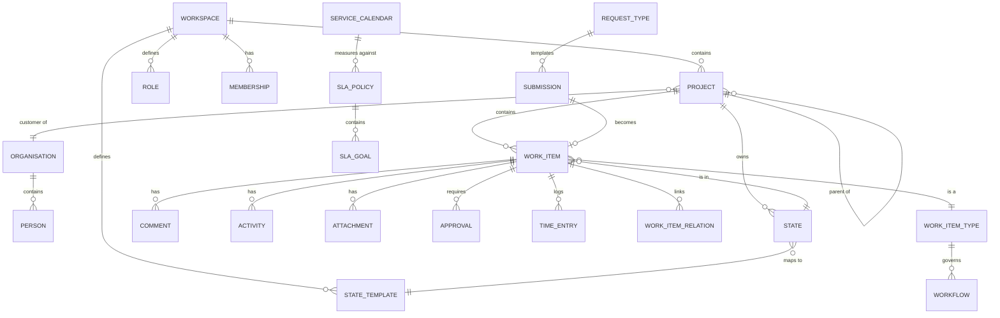

# Data model

PostgreSQL 18, Drizzle ORM, forward-only migrations in `apps/api/drizzle/`.
Schema lives in `apps/api/src/database/schema.ts`.

> **This document is authoritative for every table and column.** A feature spec that
> needs a column names it here first; a spec that names a table not defined here is wrong,
> not the schema. Rewritten 2026-09-05 after the [planning review](../07-planning/review-2026-09-05.md)
> found eight referenced tables and two dozen referenced columns that did not exist.

## Conventions

- Tables singular snake_case (`work_item`), columns snake_case.
- Primary keys are CUID2 text. Primary keys and surrogate ids are **never** sequential.
  The two human-facing counters are deliberate exceptions and neither is a primary key:
  `work_item.number` (per project, rendered `{project.key}-{number}`) and
  `submission.number` (per instance, rendered `SUB-n`). A third, narrower exception
  (decision log 2026-09-23, "Work-item activity gets its own `activity` table"):
  `activity.seq`, a `bigint generated always as identity` used only as an internal
  tiebreak for rows sharing one `created_at`. It is never a reference, never leaves the
  database, and is never in an API response — unlike the two counters above, which are
  both user-facing identifiers — so it does not carry the enumerability risk this rule
  exists to close. The primary key stays a CUID2 regardless.
- `created_at` / `updated_at` on every table, `timestamptz`, UTC. **One exception:**
  `job_lease` is a lock, not data — it carries neither, and the acquire's
  `on conflict do update` sets neither.
- **Lifecycle position is always a column named `state`, never `status`** — see the
  [glossary](../00-overview/glossary.md). This applies to every table below.
- Soft delete via `deleted_at` where a restore window is a requirement; `archived_at` is a
  *separate* concept (hidden but live) and the two never share a column. Otherwise cascade.
- Optimistic concurrency via `version integer not null default 1` on every table two people
  plausibly edit at once — see [api-design.md](api-design.md). Marked **v** below.
- The active legacy `task` table also carries `version integer not null default 1` while
  `/api/task` remains available. Every persisted task-row update advances it, including
  status, assignee, move, bulk and runtime column migration writes. The required
  `/api/v2/task/{id}` full-task PUT checks it under the task row lock; the compatible
  `/api/task/{id}` PUT checks it when `If-Match` is supplied and preserves legacy behavior
  when omitted. This compatibility column is removed only with the legacy task table.
- Money as `numeric(14,4)`. Durations as integer **minutes**. Never floats for either.
- JSONB for genuinely open shapes (plugin config, custom field values, event payloads).
  Never as a way to avoid designing a schema. Every JSONB column below names the document
  that owns its shape.
- Foreign keys always declared, always with an explicit `ON DELETE`. **Exception:**
  polymorphic references (`custom_field_value`, `attachment`, `external_link`,
  `audit_log`) carry an `entity_type` + `entity_id` pair or mutually exclusive nullable
  FKs with a `CHECK` that exactly one is set, and the owning entity's delete path cleans
  them up.
- `actor_type` accompanies every `actor_id`: `person | automation | system | api_key` —
  see [events.md](events.md). An automation, a scheduled job and an API key are
  distinguishable from a person everywhere an actor is recorded.
- Enumerations are Postgres enums or `CHECK` constraints, never free text. **Priority** is
  the ordered enum `low < medium < high < urgent` — ordering is load-bearing for the
  customer escalate-only rule and for every importer's mapping.

## Domains


```mermaid
erDiagram
    ORGANISATION ||--o{ PERSON : contains
    WORKSPACE ||--o{ PROJECT : contains
    WORKSPACE ||--o{ ROLE : defines
    WORKSPACE ||--o{ MEMBERSHIP : has
    WORKSPACE ||--o{ STATE_TEMPLATE : defines
    PROJECT ||--o{ STATE : owns
    STATE }o--|| STATE_TEMPLATE : "maps to"
    PROJECT ||--o{ WORK_ITEM : contains
    PROJECT }o--|| ORGANISATION : "customer of"
    PROJECT ||--o{ PROJECT : "parent of"
    WORK_ITEM ||--o{ COMMENT : has
    WORK_ITEM ||--o{ ACTIVITY : has
    WORK_ITEM ||--o{ ATTACHMENT : has
    WORK_ITEM ||--o{ APPROVAL : requires
    WORK_ITEM ||--o{ TIME_ENTRY : logs
    WORK_ITEM ||--o{ WORK_ITEM_RELATION : links
    WORK_ITEM }o--|| WORK_ITEM_TYPE : "is a"
    WORK_ITEM }o--|| STATE : "is in"
    WORK_ITEM_TYPE ||--o{ WORKFLOW : governs
    SUBMISSION ||--o| WORK_ITEM : becomes
    REQUEST_TYPE ||--o{ SUBMISSION : templates
    SLA_POLICY ||--o{ SLA_GOAL : contains
    SERVICE_CALENDAR ||--o{ SLA_POLICY : "measures against"
```

---

## 1. Instance and configuration

| Table | Purpose |
| --- | --- |
| `instance_setting` | Singleton row: `setup_completed_at` (the durable first-run marker — [auth-and-identity.md](auth-and-identity.md)), `setup_token_hash` and `setup_token_expires_at` (the current setup token's SHA-256 hash and one-hour expiry — never the raw token; both null once consumed, regenerated on every boot while `setup_completed_at` is null — [auth-and-identity.md](auth-and-identity.md) § Break-glass), instance name, default locale, timezone, retention periods including `notification_retention_days` (default 90), support email, terms/privacy URLs, session idle/absolute defaults and maxima, `reopen_window_days` (default 14), `clarification_window_days` (default 14), `approval_default_expiry_days` (default 7 — [approvals.md](../03-features/approvals.md) `AP-4`; a request may override it up to the 90-day cap, but the default itself is instance-wide, not per-workspace or per-request-type), `attachment_max_bytes`, `attachment_max_per_item`, `attachment_allowed_extensions text[]`, `mcp_write_ceiling_per_minute`, `api_key_burst_threshold`, health thresholds, `observability_log_levels jsonb NOT NULL DEFAULT '{"default":"info","modules":{}}'::jsonb`, `observability_config_version integer NOT NULL DEFAULT 1 CHECK (observability_config_version >= 1)`, `metrics_token_hash bytea NULL CHECK (metrics_token_hash IS NULL OR octet_length(metrics_token_hash) = 32)`, and `metrics_token_rotated_at timestamptz NULL`. The two token fields are both null or both non-null. The version advances on either a log-level update or metrics-token rotation. `observability_log_levels` is a closed object with only `default` and `modules`; `default` and each module value are `error|warn|info|debug`. Initial module keys are only `http|auth|database|jobs|audit|plugins`; validate keys and values at the API and persistence-read boundaries and constrain the JSON shape in PostgreSQL. An invalid persisted value prevents readiness. The metrics bearer is never stored in plaintext. |
| `step_up_confirmation` | One-use authentication challenge/confirmation for the pending-action and narrowly enumerated operation bindings in [pending-actions.md](pending-actions.md) `PA-15` and [security-model.md](security-model.md#sessions-csrf-and-step-up). Columns: `id` (CUID2 text primary key), `person_id` FK `person.id` `ON DELETE CASCADE`, `session_id` FK `session.id` `ON DELETE CASCADE`, `binding_kind` (`pending_action`\|`operation`), `pending_action_id` nullable FK `pending_action.id` `ON DELETE CASCADE`, `operation_key` nullable (`metrics_token_rotate`\|`oidc_group_mapping_create`\|`oidc_group_mapping_update`, exactly the PA-15 allowlist), `route_key` nullable (operation binding only; must be the fixed route registered for that operation), `expected_version` nullable integer (operation binding only, >= 1; the singleton or resource version registered for that operation), `body_hash` nullable bytea (operation binding only, exactly 32 bytes; for OIDC mapping operations it hashes the server-canonical envelope containing the fixed route key, path ids and validated request body), `challenge_nonce_hash` bytea (exactly 32 bytes), `state` (`challenge`\|`issued`\|`consumed`), `token_hash` nullable bytea (exactly 32 bytes when issued/consumed, null while a challenge), `auth_method` nullable (`password`\|`totp`\|`backup_code`\|`sso_prompt_login`), `authenticated_at`, `issued_at`, `consumed_at`, `created_at`, `challenge_expires_at`, and `token_expires_at` timestamptz. Checks enforce exactly one binding variant, the fixed operation/route pairs registered in PA-15, and state/timestamp consistency. The server sets challenge expiry to five minutes after creation and token expiry to five minutes after issuance using database time; the verifier compares expiry against database time. Hashes only: nonce and confirmation plaintext are returned once and never stored. Unique partial index on non-null `token_hash`; indexes on `(session_id, state, challenge_expires_at, token_expires_at)` and `(pending_action_id, state)`. Expired challenge/consumed rows are retained for at most 24 hours for replay diagnosis, then removed; `pending_action.step_up_token_id` is an opaque historical id without a foreign key. |
| `instance_branding` | Product name, logos (light/dark), favicon, accent colour, login background, footer links, `css_overrides jsonb` — **bounded** to the enumerated variable set in [design-system.md](../02-design/design-system.md), validated server-side |
| `instance_plugin_config` | One row per configured plugin instance. Full columns: `plugin_id`, `instance_key`, `display_name`, `enabled`, `config jsonb`, `secrets bytea` (AES-256-GCM, envelope prefixed with `key_id`), `scope` (`instance`\|`workspace`), `workspace_id` null, `portal_scope` (`agent`\|`customer`\|`both`, auth plugins), `config_version integer`, `updated_by`. **v.** Shape per [plugin-architecture.md](plugin-architecture.md) |
| `instance_feature_flag` | `feature_key`, `enabled`, `locked`. The flag key enumeration lives in [plugin-architecture.md](plugin-architecture.md) and nowhere else |
| `terminology_override` | `scope` (`instance`\|`workspace`), `workspace_id` null, `audience` (`agent`\|`customer`\|`both`, default `both`), `term_key` (enumerated in [ADR 0012](adr/0012-terminology-overlay.md)), `locale`, `forms jsonb` — CLDR plural categories (`one`, `other`, and `zero/two/few/many` where the locale has them), replacing a naive singular/plural pair. Unique on `(scope, workspace_id, audience, term_key, locale)` |
| `job_lease` | `name pk`, `owner` (`hostname:pid:bootId`), `expires_at` — the distributed lock for scheduled jobs. **Inherited from kaneo**, which defines the table (`apps/api/src/database/schema.ts`) and ships the acquire and release SQL (`apps/api/src/scheduler/leader-lock.ts`); the heartbeat/renew and the abort `signal` are ours. A lock, not data — deliberately no `created_at`/`updated_at`. See [background-jobs.md](background-jobs.md) for the exact acquire/renew/release SQL |
| `idempotency_key` | `actor_id`, `actor_type`, `key`, `route`, `request_hash`, `response_status`, `response_body jsonb`, `state` (`in_flight`\|`done`), `created_at`, `expires_at`. Unique `(actor_id, key)`. An in-flight duplicate returns `409` |
| `backup_run` | `started_at`, `finished_at`, `kind` (`database`\|`objects`\|`wal`), `bytes`, `outcome`, `notes`. Written by `scripts/backup.sh`; read by God Mode → Health for the "no backup in 48 h" warning |

Marketplace licensing ([ADR 0013](adr/0013-marketplace-metering-plugin.md)) needs no table
of its own: `license.none` / `license.aws-marketplace` are `instance_plugin_config` rows.

## 2. Identity and access
**One person, one organisation; email is not a key.** `person.organisation_id` is fixed at
creation and never changes. The identity key is `(identity_connection_id, subject)` on
`external_identity`, so **better-auth's default unique index on `user.email` is dropped at
fork** — two `person` rows in different organisations may carry the same address, which is
how one human can be both a staff member and a customer contact without the two ever being
linked (`IP-18`, [multi-tenancy.md](multi-tenancy.md#identity-across-tenants)). Anything
that needs "this human, everywhere" does not exist by design.

In the target schema better-auth owns `user`, `session`, `account`, `verification`,
`two_factor`, `passkey`, and `apikey`. The `two_factor` and `passkey` tables are planned and
are not enabled by the current API plugin configuration. The `identity_connection.mfa_upstream_mode`
field below is also a target setting; current source does not enforce it. better-auth is
used for **authentication only** — its organisation plugin is
**not** used; the directory below is ours. We add, via better-auth's `additionalFields`,
`session.portal` (`agent`\|`customer`), set at issue time and compared to the request host
by the portal-boundary middleware ([auth-and-identity.md](auth-and-identity.md)).
Step-up `auth_method` values `totp`, `backup_code`, and `sso_prompt_login` are planned
adapter values; they do not mean those proof methods are available in current source.

| Table | Key columns |
| --- | --- |
| `organisation` | `key`, `name`, `is_internal`, `domain[]`, `active`, `portal_access boolean not null default true` (false closes the customer portal to this organisation's people — sign-in is refused and live sessions are revoked; distinct from `active`, which deactivates the organisation entirely), `deleted_at`, `purge_after`, `default_customer_visibility` (`private`\|`organisation`, default `organisation`) |
| `organisation_quota` | `organisation_id` **unique**, `max_projects` (default 200), `max_work_items` (default 500 000), `max_storage_bytes` (default 20 GiB), `max_portal_users` (default 500), `max_api_requests_per_minute` (default 600), `max_webhooks` (default 10), `updated_by`. The six limits of [multi-tenancy.md](multi-tenancy.md); no row means the defaults. **Current usage is never stored here** — projects, work items and portal people are counted live off their own indexes, storage is `sum(attachment.size)` over `attachment.organisation_id`, API requests come from the rate limiter's window, webhooks are counted off `webhook`. Exceeding a limit returns `429` |
| `person` | `user_id` **nullable**, `organisation_id`, `side` (`staff`\|`customer`), `job_title`, `active`, `is_placeholder` (import-created, no login; can author history, can never be assigned or hold a membership; claimed — not duplicated — when that email later signs in), `locale`, `quiet_hours_start`, `quiet_hours_end`, `quiet_hours_timezone` |
| `workspace` | `organisation_id` **not null** (issue #192, decision log 2026-09-22 "#192's tenant-attribution decision: Option A+D" — every workspace this codebase creates today is internal, so existing rows backfill to the single internal organisation the migration's own SQL seeds if the boot seed has not run yet), `slug`, `name`, `logo`, `description`, `default_sla_policy_id` null, `time_entry_backdate_limit_days` (default 30), `kb_review_step_enabled`, `deleted_at`, `purge_after` — the same 30-day recovery window as `organisation`, so a workspace delete does not bypass the windows its `project` and `work_item` children carry |
| `workspace_feature_flag` | `workspace_id`, `feature_key`, `enabled`. Unique `(workspace_id, feature_key)`. The middle level of the flag resolution `project → workspace → instance → default` |
| `membership` | The **materialized effective membership** for one `(person_id, scope, scope_id)`; target unique key `(person_id, scope, scope_id)`. Carries exactly one `role_id`, `sees_all` projected only from an active explicit direct grant, and `inherited_from` for ancestor-project reach. `derived_from` is transitional: stop writing it and keep it null once the grant ledger is authoritative; remove only through a documented forward migration. An organisation-scoped membership is how a customer-side person holds the `customer` role on their organisation — created by invitation, JIT or SCIM; a staff person never holds one |
| `role` | `scope` (`instance`\|`organisation`\|`workspace`\|`project` — `organisation` exists for exactly one system role, `customer`), `workspace_id`, `key` (server-generated kebab slug, unique per `(scope, workspace_id)`, immutable), `name`, `description`, `rank`, `capabilities jsonb` (string[]), `is_system`, `is_editable`. **v** |
| `team` | `workspace_id`, `name`, `capacity_days_per_week`, `is_cab` (exactly this team's members may decide CAB approvals) |
| `team_member` | `team_id`, `person_id`, `allocation_pct`, `is_lead` |
| `invitation` | `email`, `organisation_id`, `role_id`, `token_hash`, `expires_at`, `state`, `invited_by` |
| `api_key` | Extension of better-auth's `apikey`: `apikey_id`, `workspace_id` null, `person_id` null (`CHECK` exactly one set — a workspace key is a service key with no person), `capabilities jsonb` (a service key's set is bounded by its creator's expanded authority at creation), `ip_allowlist inet[]`, `rate_limit_per_minute`, `expires_at`, `last_used_at`, `last_used_ip`, `prefix`, `is_mcp`, `disabled_at`, `disabled_reason`. **`CHECK (NOT is_mcp OR person_id IS NOT NULL)`** — an MCP key is always a personal key owned by a named human; service keys are never MCP keys ([mcp-server.md](../03-features/mcp-server.md)) |
| `user_preference` | `person_id`, `scope` (`global`\|`workspace`\|`project`), `scope_id` null, `key`, `value jsonb`. The per-user UI store: layout per project, density, chosen columns, column widths, collapsed groups, pinned views, drafts. Unique `(person_id, scope, scope_id, key)` |
| `legal_hold` | `scope` (`organisation`\|`person`), `scope_id`, `placed_by`, `placed_at`, `reason`, `lifted_by` null, `lifted_at` null. An **open** row (`lifted_at is null`) suspends `audit-purge`, `attachment-gc`, soft-delete purge, read-notification retention purge, terminal notification-child/digest/event-envelope retention purge, and hard delete of held business/history data in the matching scope. It does not suspend physical cleanup of an expired `outbox_dedupe_reservation`; see [background-jobs.md](background-jobs.md) and [data-protection.md](../05-operations/data-protection.md). Placing and lifting write `legal_hold.placed` / `legal_hold.lifted` audit rows. Partial unique index `(scope, scope_id) where lifted_at is null` — at most one open hold per scope |

`sees_all` on a membership is projected only from the selected active direct grant; an OIDC or
SCIM grant can never set or inherit it. `inherited_from` records that a membership came from
an ancestor project, per OpenProject's model. The one-role materialization, source grant
ledger and migration constraints below are a **proposed target** pending approval of
[ADR 0015](adr/0015-membership-grant-provenance.md); they are not implemented schema.

**`workspace_role`** (`id`, `workspace_id`, `role` a name, `permission` a JSON
`{resource: action[]}` map, `is_system boolean not null default false` (issue #318,
security — `true` only for a row `seed-default-workspace-roles.ts`'s backfill or
`create-workspace.ts`'s creation-time seed inserted for `viewer`/`member`/`admin`; a custom
row `create-workspace-role.ts` inserts is always `false`, including one that shares a
`BUILT_IN_ROLES` name — distinguishes a genuine seeded built-in row from a custom row that
merely took the name, which the legacy capability check and `resolveIdentity`'s adapter both
require before granting that name's built-in capabilities; see rbac.md), `created_at`,
`updated_at`, `UNIQUE (workspace_id, role)`) is the LEGACY, pre-`role`-table shape kaneo's
inherited better-auth `organization()` plugin uses — inherited, transitional, and on its way
out once the `organization()` retrofit (issue #6) reaches S10 and the plugin unmounts. The
organization-plugin retrofit's S7 stage gives it its first native (non-plugin) route
surface; the table above is the FUTURE shape this one is replaced by, not a variant of it.

### External identity — OIDC connections and SCIM provisioning

Decided 2026-09-05: Microsoft Entra OIDC and SCIM are **core P3 delivery**
([identity-provisioning.md](../03-features/identity-provisioning.md)). OIDC connections
have typed rows here rather than generic `instance_plugin_config` rows because the
organisation FK and the SCIM link cannot live in `config jsonb`; non-OIDC auth plugins
(`auth.password`, `auth.email-otp`, `auth.magic-link`) stay in `instance_plugin_config`.

| Table | Key columns |
| --- | --- |
| `identity_connection` | `provider_type` (`entra` now; `okta`\|`keycloak`\|`generic_oidc` reserved), `portal_scope` (`agent`\|`customer` — **never both**), `organisation_id` null (**`CHECK` set iff `portal_scope = 'customer'`**), `display_name`, `issuer`, `tenant_id` null, `client_id`, `client_secret bytea` (same envelope as plugin secrets), `redirect_uri`, `scopes text[]`, `claim_mapping jsonb`, `domain_bindings text[]` (each domain bound to exactly one connection — unique across rows), `jit_policy` jsonb (`enabled`, default role, `required_entra_app_role`: exact nonempty Entra application-role value required on every Entra connection at creation/configuration save and before enable, independently of JIT enabled state; missing/malformed persisted admission config fails login closed and is surfaced as invalid connection health), **`max_role_rank`** (the one ceiling for everything this connection may grant — JIT default role and group mappings; null on customer connections, whose only role is `customer`; lowering an enabled agent connection's ceiling immediately retires its above-ceiling external grants in the same configuration transaction under IP-3/IP-22), `mfa_upstream_mode` (`claim`\|`static`\|`off`; planned target setting, not enforced by current source), `enabled`, `config_version integer NOT NULL DEFAULT 1 CHECK (config_version >= 1)`, `health_state`, `health_checked_at`, `created_by`, `updated_by`. **v.** `config_version` advances on each committed connection-configuration or OIDC group-mapping mutation; the mapping editor uses it for compare-and-set. Unique `(organisation_id)` where not null — one active customer connection per organisation in the first release |
| `scim_connection` | `identity_connection_id` **unique**, `token_hash`, `token_prefix`, `token_created_at`, `token_rotated_at`, `allowed_resources text[]` (`users`, `groups`), `attribute_mapping jsonb`, `lifecycle_policy` (`end_memberships`\|`keep_memberships`, default `end_memberships`), `enabled`, `last_sync_at`, `last_sync_outcome`, `last_failure jsonb` (never secrets). Rotation replaces `token_hash` — **no previous-token grace column, by decision** |
| `external_identity` | `identity_connection_id`, `person_id`, `user_id` null (null until first login), `issuer`, `subject` (immutable — Entra `oid`), `scim_external_id` null, `user_name_snapshot`, `email_snapshot`, `active`, `provisioned_via` (`jit`\|`scim`\|`invite`), `first_seen_at`, `last_login_at`, `deactivated_at`. Unique `(identity_connection_id, subject)`; unique `(identity_connection_id, scim_external_id)` where not null. **Email is an attribute, never the key** |
| `scim_group_mapping` | `scim_connection_id`, `external_group_id`, `external_group_name_snapshot`, `role_id` (an **existing** role; never a role granting `instance:*`, never `sees_all`), `scope` (`organisation`\|`workspace`), `scope_id`, `enabled`, `created_by`. Unique `(scim_connection_id, external_group_id)`. `CHECK`: a customer connection's mapping targets a customer role only |
| `oidc_group_mapping` (proposed) | `id` CUID2 PK; `identity_connection_id` FK `ON DELETE RESTRICT`; immutable `external_group_id` (canonical lower-case, hyphenated Entra object-id UUID), nullable display-only `external_group_name_snapshot`; existing `role_id` FK `ON DELETE RESTRICT`; `scope` (`organisation`\|`workspace`), `scope_id` (customer: the connection's organisation id; agent: a workspace eligible under IP-3); `enabled` not null default true; `created_by`, timestamps. Unique `(identity_connection_id, external_group_id)`, one role/scope per group. Every create, edit, or enable validates connection provider/portal/organisation, resource ownership, role side/scope/rank and forbidden capabilities. Every administrative OIDC mapping write is elevated and audited; disable, role change or target change retires only this mapping's active OIDC grants |
| `membership_grant` (proposed) | Authoritative source-provenance ledger, not an RBAC role list: CUID2 `id`; nullable `membership_id` FK to effective `membership` `ON DELETE SET NULL`; `person_id`; `scope`, `scope_id`, `role_id`; `source_kind` CHECK `direct`\|`jit_default`\|`oidc_group`\|`scim_group`; nullable `external_identity_id`, `identity_connection_id`, `oidc_group_mapping_id`, `scim_group_mapping_id` FKs; `sees_all` not null default false; nullable `direct_origin` CHECK `admin`\|`system_backfill`; nullable `granted_by_person_id`; `created_at`, `updated_at`, nullable `last_confirmed_at`, nullable `revoked_at`, and nullable `revocation_reason` CHECK `claim_removed`\|`claim_missing`\|`claim_overage`\|`admission_failed`\|`mapping_disabled`\|`mapping_changed`\|`role_deleted`\|`connection_disabled`\|`scim_group_removed`\|`scim_deactivated`\|`direct_removed`; `mapping_changed` also records retirement caused by a connection grant-policy or target-eligibility change such as a lower `max_role_rank` (IP-22). Source CHECKs are exact: `direct` requires direct origin and no external source (with `granted_by_person_id` required only for `admin`, null for `system_backfill`); external sources have no direct fields and force `sees_all=false`; `jit_default` requires external identity/connection and no mapping; `oidc_group` and `scim_group` each require external identity/connection plus exactly their matching mapping FK. `system_backfill` is migration-only, never API input. Cross-table same-connection, ownership, side and rank validation is done by the locked writer, not claimed as a SQL CHECK |
| `scim_group_member` | `scim_group_mapping_id`, `external_identity_id`, nullable `membership_id` FK to the effective membership, unique `membership_grant_id` FK to the corresponding SCIM grant, and nullable `revoked_at`. An active row links an active SCIM grant and, when materialized, the same effective membership; both membership pointers are null for a fail-closed role conflict. `membership_id` may also become null when no effective membership remains; the historical grant id remains. Removal or connection-ceiling ineligibility retires the linked grant and marks history revoked before recomputing the effective row |
| `provisioning_event` | `identity_connection_id`, `scim_connection_id` null, `external_identity_id` null, `kind` (`user.created`\|`user.updated`\|`user.deactivated`\|`user.reactivated`\|`group.mapping_changed`\|`group.member_added`\|`group.member_removed`\|`request.denied`\|`auth.failed`\|`token.rotated`\|`token.revoked`\|`connection.changed`\|`sync.failed`), `outcome`, `detail jsonb` (structured, **never secrets, never raw tokens**), `actor_type`, `trace_id`, `created_at`. The provisioning ledger; events that change authority, reach or configuration also write `audit_log` |

The proposed grant ledger makes provenance explicit without changing the single-role RBAC
contract. For each `(person_id, scope, scope_id)`, a valid active direct grant alone wins;
otherwise the external grant with greatest role rank wins. At an equal rank,
`scim_group > oidc_group > jit_default` only when `role_id` is the same. Two different
role ids tied at the highest rank suppress the external effective membership and produce an
operator-visible conflict; never choose by id or union capabilities. The effective unique
key and the locked writer prevent concurrent OIDC/SCIM updates from producing duplicate
rows or losing another source. Retiring the last valid grant removes the effective row via
the internal projection writer and preserves grant/audit history; it is not a user DELETE.

The direct membership lookup index remains. The target adds partial indexes for active grants:
`(person_id, scope, scope_id) WHERE revoked_at IS NULL`; unique active direct grant on
`(person_id, scope, scope_id)`; unique active JIT grant on
`(external_identity_id, scope, scope_id)`; and unique active OIDC/SCIM group grants on
`(external_identity_id, oidc_group_mapping_id)` and
`(external_identity_id, scim_group_mapping_id)`. Before any schema DDL, backfill, unique
constraint, or effective projection, a future migration must run a read-only provenance
preflight over **every** legacy membership row. Classify a row only when durable evidence
establishes its exact source and required grant fields: an explicit administrator grant
(including an invitation only where its inviter, target, and grant are unambiguously
linked), a connection-bound JIT default, or a specific SCIM group membership.
`derived_from` may identify a SCIM group link when that linkage validates, but
`derived_from IS NULL` does not prove a direct grant; invitation, JIT, and SCIM rows may
also have null provenance. Any ambiguous or unclassified row, including one with null
`derived_from`, stops the **whole migration before DDL or data changes** and requires
explicit owner-approved, per-row reconciliation. Do not guess direct provenance, discard a
row, or materialize partial effective state. Only after every row is classified and any
duplicate-row repair is explicitly approved may the migration proceed. Its DDL, complete
grant backfill, effective projection, and constraints must run in one transaction; any
failure rolls back the entire migration so the old schema and membership data remain
unchanged. Do not use non-transactional DDL for this cut-over. Recovery requires supplying
the missing owner-approved classifications, rerunning the read-only preflight against the
unchanged legacy data, then retrying the complete migration. A role/mapping change retires
the old grant and inserts a new row; it does not edit a grant into a different authority
source or role. `claim_missing` records an absent or malformed OIDC groups claim
that yields no usable current set; `claim_removed` records an omitted group from an otherwise
complete valid set; `claim_overage` records the Entra overage form.

Provisioning/audit detail contains source kind, connection, external identity, mapping,
affected scope/role ids and a bounded reason, never raw claims or tokens. `audit_log` records
before/after ids, not raw claim arrays. Reconciliation and the connection-ceiling
transaction use only existing provisioning event kinds: `group.member_added`,
`group.member_removed`, `group.mapping_changed`, `connection.changed`, `request.denied`,
and `auth.failed`. A lower-ceiling policy retirement uses `mapping_changed`; it adds no
event key or enum value. Grant delta, effective projection and provisioning/audit rows commit in the same
transaction under the existing AU-14 audit-failure exception; publish cache invalidation to
all replicas only after commit. An invalidation loss remains within the existing 30-second
authority-cache bound.

## 3. Projects and states

| Table | Key columns |
| --- | --- |
| `project` | `workspace_id`, `parent_id`, `key` (**unique per instance**), `name`, `icon` (a lucide icon name from the checked-in allowlist), `kind` (`project`\|`managed_service`), `organisation_id` **nullable** (null = internal), `manager_id` → `person` (the "exactly one project manager" of `PR-6`), `owner_team_id` null (reach step 5 in [rbac.md](rbac.md)), `start_date`, `end_date`, `support_level`, `service_calendar_id`, `sla_policy_id` null, `default_assignee_id`, `default_billable` (default true), `default_comment_visibility` (`public`\|`internal`, default `internal` — `CA-2`'s
per-project composer default), `cycle_rollover_policy`, `health` (RAG), `archived_at`, `deleted_at`, `purge_after`, `last_work_item_number`. **v** |
| `project_slug_claim` | `slug` (**primary key**), `project_id` — a permanent claim registry mirroring `work_item_key_claim` (§4) exactly: once a slug is claimed, by any project, it is claimed forever, independent of what later happens to that project (rename, archive, soft- or hard-delete). No FK to `project`, deliberately — a hard-deleted project's claim row must survive it. Exists because `work_item.key` (`{project.slug}-{number}`, §4) is globally unique and its claims never release, so a `project.slug` value that became reusable again would let a new tenant inherit an already-claimed key range (issue #23/#261's finding D1; `docs/07-planning/decision-log.md`'s "F1 addendum") |
| `project_feature_flag` | `project_id`, `feature_key`, `enabled` |
| `state_template` | **Workspace-scoped**: `workspace_id`, `key`, `name`, `group` (`backlog`\|`unstarted`\|`started`\|`completed`\|`cancelled`), `colour`, `archived_at` — hidden from the picker a project uses to adopt a new state, still referenceable by every project's concrete `state` rows already mapped to it; a template with any `state` row pointing at it is never deleted. The five `group` values are the only fixed lifecycle vocabulary — [ADR 0011](adr/0011-ticket-lifecycle-engine.md). `group` is a SQL reserved word and is written `"group"` in the DDL. This is the row a workspace-scoped `workflow`'s transitions reference (`workflow_transition.from_state_template_id`/`to_state_template_id`, §6) — **never** a project's concrete state directly, which is what lets one workflow serve every project that adopts it |
| `state` | **Project-scoped**: `project_id`, `state_template_id` → `state_template` (**not null**, `ON DELETE RESTRICT`), `position`, `is_default` (**at most one per project** — partial unique index on `(project_id) where is_default`), `archived_at` — hidden from pickers, still referenceable. Archiving is what "removing a state" ([ADR 0011](adr/0011-ticket-lifecycle-engine.md)) does at the project level; a `state` with `work_item` or `activity` rows pointing at it is never deleted. This is a project's **own** concrete lifecycle position: which templates it has adopted, in what order, and which is the default for new work items (`PR-17`). `work_item.state_id` (§4) references this table — **never** `state_template` directly. `state` carries no `group` column of its own: a concrete state's group is its mapped template's `state_template.group` |
| `milestone` | `project_id`, `name`, `date`, `reached_at` |
| `prerequisite` | `project_id`, `title`, `owner_side`, `due_date`, `is_blocking`, `completed_at` |
| `stakeholder` | `project_id`, `person_id`, `role`, `escalation_order`, `escalation_wait_minutes`, `active` |
| `document_link` | `project_id`, `url`, `title`, `customer_visible` |

**Why a state has two levels — `state_template` and `state` (corrected 2026-09-09).**
Workflows and work item types are workspace-scoped, and one workflow must be able to serve
every project that uses it — [ADR 0011](adr/0011-ticket-lifecycle-engine.md)'s "one
lifecycle engine" claim. At the same time each project owns its own concrete lifecycle
position (`PR-17`: "each project has its own states"), and those are not the same
requirement solved by the same table. `state_template` is the workspace-level catalogue a
workflow's transitions reference; `state` is a project's own row, mapped to exactly one
template via `state_template_id`. A workflow attached to a work item type is portable
across every project that has **adopted** — created a concrete `state` row for — the
templates its transitions need. [workflows.md](../../03-features/workflows.md) `WF-2` and
"Resolving a transition to a project's state" specify exactly how a transition's template
reference resolves to a project's concrete row at runtime; nothing here is left for an
implementer to invent.

*(Corrected 2026-09-09, superseding the correction below: making `state` itself
workspace-scoped, with `project_state` as a per-project enable/order/default overlay,
fixed cross-project workflow reuse but broke the other half of the same problem — a
project's concrete lifecycle position stopped being its own and became workspace-global,
the opposite of what `PR-17`'s "each project has its own states" was written to guarantee.
`project_state` is retired; its job (`position`, `is_default`) now lives directly on the
project-scoped `state` row above, and "enabled" is simply whether a project has created a
`state` row for a template at all. This is Thomas's decision — see
[ADR 0011](adr/0011-ticket-lifecycle-engine.md), which is **Accepted** and records it in
full: do not move concrete `state` rows back to the workspace, and do not make workflows
project-scoped.)*

*(2026-09-05 note, retained for history: the very first draft made `state` project-scoped
with no shared workspace concept at all, which meant a workspace-level workflow could serve
exactly one project — the opposite failure the correction above was written against. Both
of these superseded attempts are why the split above exists instead of a single table.)*

`kind` distinguishes a dated **project** from an indefinite **managed service** — v1's
most useful structural idea. Managed services have a support level and a cover window and
no cycles; projects have dates and a backlog.

## 4. Work

| Table | Key columns |
| --- | --- |
| `work_item_type` | `workspace_id`, `key`, `name`, `icon`, `category` (`service`\|`delivery`), `workflow_id`, `sla_policy_id`, `is_epic`, `is_change` (drives CAB rules — never matched by type name). Unique `(workspace_id, key)` and, since issue #192, unique `(workspace_id, id)` — the composite-FK target `work_item.type_id` pins itself to (see the `work_item` row below) |
| `work_item` | `project_id`, `workspace_id` **not null** (issue #192, decision log 2026-09-22 "#192's tenant-attribution decision: Option A+D" — denormalised from `project.workspace_id` at row-creation time by #23's write path, and composite-FK-anchored to `project (workspace_id, id)` so it can never drift from the project it was copied from), `type_id` (composite-FK'd to `work_item_type (workspace_id, id)`, not a plain single-column reference — closes the cross-tenant half of #186 S2, #191 O5: a work item's type must belong to its own `workspace_id`, not just exist), `number` (**`> 0`**), `key` (**stored**, set once at insert from `{project.key}-{number}`; never regenerated), `title`, `description jsonb` (Tiptap), `state_id` (**`ON DELETE RESTRICT`** — states are archived, never deleted out from under an item), `priority`, `assignee_id` (**`ON DELETE RESTRICT`** — people are deactivated, never deleted), `requester_id`, `parent_id`, `service_id` null, `start_date`, `due_date`, `position numeric(20,10)` (**never `NaN`** — `NaN` compares greater than every non-`NaN` value, so one bad row would head every `ORDER BY ... desc` and tail every `... asc` for ever), `estimate_point_id`, `cycle_id`, `module_id`, `sla_started_at` (copied from `submission.created_at` on acceptance; otherwise `created_at`), `first_response_at timestamptz null` (set once, by the first `comment` with `visibility = 'public'` whose author is a `side = 'staff'` person — the stored fact the `first_response` SLA metric is computed from, `SLA-7`), `resolved_at`, `customer_visibility` (`private`\|`organisation`), `archived_at`, `deleted_at`. **v**. Both new composite FKs are `ON UPDATE NO ACTION`, never `CASCADE` — PR #191's own O1 finding: a composite FK whose referenced columns include a mutable, non-PK column can silently cascade a work item across a tenant boundary if that keyword is `CASCADE`. Unique `(project_id, id)` (`work_item_project_id_id_unique`, the `parent_id` composite-FK target) and, since decision log 2026-09-23 ("Work-item activity gets its own `activity` table"), unique `(workspace_id, id)` (`work_item_workspace_id_id_unique`, following the `work_item_type_workspace_id_id_unique` precedent) — the composite-FK target `activity.work_item_id` pins itself to (see the `activity` row below) |
| `work_item_key_alias` | `old_key`, `work_item_id` — a cross-project move re-keys the item and the old key redirects |
| `work_item_key_claim` | `key` (**primary key**), `work_item_id` — the shared uniqueness registry both `work_item.key` and `work_item_key_alias.old_key` are composite-FK'd into (issue #191, closing #186 S5's TOCTOU race in the trigger it replaces): a key string is claimed here exactly once, ever, for the life of the system, so Postgres's own real PRIMARY KEY index — not a hand-written trigger's `SELECT`/`EXISTS` check — is what rejects a collision, in either direction, under any concurrent interleaving. See the table's own comment in `schema.ts` for the full design |
| `work_item_template` | `workspace_id`, `type_id`, `name`, `title`, `description jsonb`, `labels jsonb`, `custom_field_values jsonb`, `checklist_template_id` null, `recurrence jsonb` null (a recurrence rule; the scheduler instantiates — see [review](../07-planning/review-2026-09-05.md)) |
| `checklist_template` / `checklist_item` | `checklist_template (workspace_id, name)`; `checklist_item (work_item_id \| release_id \| template_id, position, text, done_at, done_by)` — one checklist model shared by work items (`WI-5`) and releases (`REL-3`) |
| `work_item_relation` | `source_id`, `target_id`, `type` (`relates`\|`blocks`\|`duplicates`\|`precedes`\|`requires`) |
| `watcher` | `work_item_id`, `person_id`, `source` (`explicit`\|`implicit`), `muted` |
| `label` | `workspace_id`, `project_id` null (null = workspace label), `name`, `colour` |
| `work_item_label` | join |
| `comment` | `work_item_id`, `author_id`, `actor_type`, `body jsonb`, `visibility` (`public`\|`internal`), `activity_id` null (links a transition note to its transition), `edited_at`, `deleted_at` null, `deleted_by` null — the tombstone `CA-18` renders ("Comment deleted by Jane, 2 March"): the row, its author and its position survive, the body is not rendered, and the row is purged with the 30-day soft-delete sweep. **v** |
| `comment_version` | `comment_id`, `number`, `body jsonb`, `edited_by`, `created_at` — the edit history `CA-17` renders |
| `canned_response` | `workspace_id`, `name`, `body jsonb`, `visibility_default`, `created_by` |
| `activity` | The work-item journal (decision log 2026-09-23, "Work-item activity gets its own `activity` table; kaneo's becomes `task_activity`" — migration 0066). `workspace_id` **not null** (denormalised at insert, same #192 shape as `work_item.workspace_id`, for the same RLS/purge reach-filtering reason), composite-FK'd `(workspace_id, work_item_id) → work_item (workspace_id, id)` — closes the cross-tenant gap a plain single-column FK on `work_item_id` cannot see, the same `(scope_id, id)` technique #192/#186 S2 use elsewhere. `ON UPDATE NO ACTION` (never `CASCADE`, PR #191's O1 finding), `ON DELETE CASCADE` (decision log 2026-09-23, "Activity addendum: ON DELETE CASCADE, and Postgres 16 stays supported" — S1 of PR #275's mandatory Opus 5.5 review: work items ARE hard-deleted today, by cascade, on every workspace/account-deletion path, so `RESTRICT` made any workspace that ever had a work item permanently undeletable; "retained forever" means no time-based purge of its own, not that the journal outlives its tenant's hard deletion). `work_item_id`, `actor_id`, `actor_type`, `verb`, `field`, `old_value`, `new_value`, `payload jsonb`, `visibility` (`public`\|`internal` — the verb→visibility table in [comments-and-activity.md](../03-features/comments-and-activity.md); unmapped verbs are `internal`), `workflow_version_id` null, `created_at`, `seq bigint generated always as identity` (unique — an internal same-instant tiebreak only, never a reference, never in an API response; the Conventions section's named exception to "surrogate ids are never sequential") |
| `task_activity` | Kaneo's original, unmodified activity/comment table, renamed off the `activity` name in the same migration that introduced the table above. Still keyed on `task_id`, not `work_item_id`; still backs every legacy task/comment route. Not part of the work-item journal, and not documented further here — it is inherited-and-frozen, not part of this data model's own design |
| `task_comment` | Kaneo's original, unmodified comment table, renamed off the `comment` name in the same migration (0073) that introduced the `comment` table above (same precedent as `task_activity`'s rename off `activity`, migration 0066). Still keyed on `task_id`, not `work_item_id`; still backs every legacy task/comment route. Not part of the work-item comment model, and not documented further here — it is inherited-and-frozen, not part of this data model's own design |
| `attachment` | `workspace_id` **not null**, `organisation_id` null (null = internal) — both denormalised at insert, because the object-key template ([storage-and-attachments.md](storage-and-attachments.md)) is built from the workspace, the per-organisation storage quota sums on the organisation, and `attachment-gc` needs both to honour an open `legal_hold`; a `submission_id` row reaches its workspace only through a two-hop join, which is why these are stored rather than derived. `work_item_id` \| `comment_id` \| `submission_id` (`CHECK` exactly one), `object_key`, `filename`, `mime_type`, `size`, `state` (`pending`\|`ready`\|`deleted`), `customer_visible`, `uploaded_by`, `deleted_at`. Partial index on `state = 'pending'` for the hourly cleanup |

**`activity` is the journal.** Every field change writes a row with old and new value.
Point-in-time reconstruction, baselines and the audit trail all derive from it — borrowed
from OpenProject's `Journal`/`Change` design.

**"Open" and "closed"**, wherever a spec uses the words: a concrete `state` row carries no
`group` column of its own (§3) — its group is its mapped template's `state_template.group`,
reached through `state.state_template_id`. So closed ⇔
`state_template.group in ('completed', 'cancelled')`, resolved for a given `state` (or
`work_item.state_id`) by joining through that foreign key — never a bare `state.group`
column, which does not exist; open ⇔ anything else. Never a state name. In SQL:
`... from work_item join state on state.id = work_item.state_id join state_template on
state_template.id = state.state_template_id where state_template.group in
('completed', 'cancelled') ...`.

## 5. Custom fields

| Table | Key columns |
| --- | --- |
| `custom_field_section` | `workspace_id`, `name`, `position` |
| `custom_field` | `workspace_id`, `section_id`, `entity_type` (`work_item` in P4; `project`, `person`, `time_entry`, `cycle` later), `key`, `name`, `format`, `options jsonb`, `is_required`, `default_value`, `help_text`, `customer_visible`, `visibility_condition jsonb` null (single-level: `{ field_key, op: eq\|neq\|in\|is_set, value }`), `position`, `deleted_at` (soft-deleted, restorable 30 days — the convention above; there is no `archived_at` here, because "hidden but live" is not a custom-field state we offer) |
| `custom_field_type_visibility` | `custom_field_id`, `work_item_type_id`, `visible`, `required` — applies only when `entity_type = 'work_item'` |
| `custom_field_value` | `custom_field_id`, `entity_type`, `entity_id`, `value jsonb`, `project_id` null, `organisation_id` null — the last two denormalised at insert from the parent entity, so this polymorphic table can be reach-filtered ([multi-tenancy.md](multi-tenancy.md), [rbac.md](rbac.md)) without a per-`entity_type` join |

Formats: `text`, `long_text`, `number`, `decimal`, `date`, `datetime`, `boolean`,
`select`, `multi_select`, `user`, `multi_user`, `url`, `email`, `currency`.

## 6. Workflow — the lifecycle engine

| Table | Key columns |
| --- | --- |
| `workflow` | `workspace_id`, `key`, `name`, `active_version_id`. **v** |
| `workflow_version` | `workflow_id`, `number`, `published_at`, `published_by` |
| `workflow_transition` | `version_id`, `from_state_template_id` → `state_template`, **nullable** (null = from any state template, `WF-5`), `to_state_template_id` → `state_template` (**not null**), `role_id` (null = all), `note_policy` (`none`\|`optional`\|`required`), `note_visibility`, `requires_approval`, `approval_policy` (`any`\|`all`), `requires_cab`, `is_reopen boolean not null default false` (**at most one per workflow version** — partial unique index `(version_id) where is_reopen`; this is "the" reopen transition `WF-21` and `CP-8` resolve), `guards jsonb`, `effects jsonb`. References templates, never a project's concrete `state` — see §3 and [workflows.md](../03-features/workflows.md) "Resolving a transition to a project's state" |
| `scheduled_transition` | `work_item_id`, `transition_id`, `from_state_id` → `state` (the work item's **concrete, project-scoped** state at the moment the effect fired — the row is cancelled if the item has since left it), `to_state_id` → `state` (**concrete**, resolved from the effect's `to_state_template_id` against the work item's own project at write time — see below), `due_at`, `state` (`pending`\|`fired`\|`cancelled`), `created_at`. Written by the `schedule_transition` effect below; scanned and fired by `reminder-scan` ([background-jobs.md](background-jobs.md)), which executes the already-resolved concrete transition — no template lookup happens at fire time. Index on `(due_at) where state = 'pending'` |

`guards` and `effects` are arrays drawn from **closed vocabularies owned by
[workflows.md](../03-features/workflows.md)**:

- guards — a JSON array, each element shaped `{ "type": "<guard-type>", ...fields }`. The
  five recognised types: `children_closed`, `no_open_blockers`, `assignee_present`,
  `field_required` (`{ "type": "field_required", "field": "<key>" }` — `field` is native,
  `cf.<key>`, or a satellite such as `change.rollback_plan`), `change_risk_at_most`
  (`{ "type": "change_risk_at_most", "level": "low"|"medium"|"high" }`). All guards on a
  transition must pass. Each has a reason code `guard.<type>` returned in the problem
  detail when it blocks (`WF-16`); a guard object whose `type` is none of the five —
  written by a newer build, a hand edit, or a downgrade — fails **closed** with
  `guard.unrecognized`, never silently skipped.
- effects — `set_assignee { personId | 'default' }`, `clear_assignee`, `pause_sla`,
  `resume_sla`, `set_field { field, value }`, `schedule_transition { after_minutes,
  to_state_template_id }` (the "pending until" pattern — `to_state_template_id` is
  resolved immediately, against the work item's own project, to a concrete `state` row
  and stored as such in the `scheduled_transition` row above, together with the item's
  current concrete state as `from_state_id`; the row is the only record of the pending
  transition, and `reminder-scan` is what fires it). Entering a `completed`-group state writes
  an `sla_pause` row with reason `resolved`; leaving it closes that row — which is how
  `WF-18` "resumes rather than restarts" is implemented against a never-stored SLA state.

The `role_id` column gives **transition legality per role** — OpenProject's
type × role × status model. Versions are immutable once published; `activity` records
which version was active, so history remains interpretable after a workflow changes.

## 7. Service desk

| Table | Key columns |
| --- | --- |
| `request_type` | `workspace_id`, `key`, `name`, `description`, `icon`, `group`, `work_item_type_id`, `form_schema jsonb` (shape incl. `showIf` in [request-types-and-catalogue.md](../03-features/request-types-and-catalogue.md)), `sla_policy_id`, `default_assignee_id`, `auto_accept`, `customer_visible`, `force_private`, `position`. **v** |
| `request_type_version` | `request_type_id`, `number`, `form_schema`, `effective_from` |
| `organisation_request_type` | `organisation_id`, `request_type_id` — the per-organisation catalogue. **No row ⇒ not visible and not submittable** |
| `submission` | `number` (from an instance-wide sequence, never reused; rendered `SUB-n`), `organisation_id`, `requester_id`, `request_type_id`, `request_type_version_id`, `form_data jsonb`, `state` (`new`\|`clarifying`\|`accepted`\|`declined`\|`duplicate`\|`withdrawn`), `claimed_by`, `claimed_at`, `customer_visibility`, `work_item_id`, `created_at` |
| `submission_message` | `submission_id`, `author_id`, `actor_type`, `body`, `created_at` |
| `deflection_event` | `person_id`, `request_type_id`, `kb_article_id`, `query`, `abandoned_at` null |
| `service_calendar` | `workspace_id`, `name`, `timezone`, `windows jsonb` (per weekday, minutes-from-midnight `0..1440`), `holidays jsonb` (dated, ranged, or `{ recurs: 'annually', month, day, name }` — expanded at read) |
| `sla_policy` | `workspace_id`, `name`, `description`, `calendar_id`, `at_risk_threshold_pct` (default 75), `active_version_id`. **v** |
| `sla_policy_version` | `policy_id`, `number`, `effective_from` |
| `sla_goal` | `version_id`, `metric` (`first_response`\|`resolution`), `work_item_type_id`, `priority`, `target_minutes` |
| `sla_pause` | `work_item_id`, `metric`, `started_at`, `ended_at`, `reason` (`waiting_customer`\|`resolved`\|`manual`\|…). At most one open row per `(work_item_id, metric)` — `unique (work_item_id, metric) where ended_at is null`. There is no `kind` column; `reason` says why, and the open row is identified by the metric alone |
| `work_item_sla_cache` | `work_item_id`, `metric`, `state` (`none`\|`ok`\|`at_risk`\|`breached`\|`met`\|`missed` — snake_case; the six values of [sla.md](../03-features/sla.md) and nowhere else), `due_at`, `computed_at`. **A cache for edge detection and list filtering only** — the detail endpoint always recomputes; where they disagree the computed value wins ([ADR 0009](adr/0009-lazy-sla-evaluation.md)) |
| `approval` | `work_item_id`, `transition_id` (the gate it satisfies), `kind` (`customer`\|`cab`), `requested_by`, `approver_id`, `state` (`pending`\|`approved`\|`rejected`\|`expired`\|`withdrawn`), `expires_at`, `reminder_50_sent_at`, `reminder_90_sent_at`, `decided_at`, `decision_note` |
| `satisfaction_rating` | `work_item_id`, `person_id`, `score`, `comment`, `created_at`, `updated_at`. Unique `(work_item_id, person_id)` |
| `request_participant` | `work_item_id` null \| `submission_id` null (`CHECK` exactly one), `person_id`, `added_by` — a customer's colleagues CC'd on a request; participants are in reach for a `private` request |

**Authoritative SLA state is never stored.** It is computed on read from
`sla_started_at + goal.target_minutes` evaluated against the service calendar, minus
paused intervals. The cache above exists so lists can filter and `sla-scan` can detect
edges without recomputing every item.

## 8. Agile

| Table | Key columns |
| --- | --- |
| `cycle` | `project_id`, `name`, `start_date`, `end_date`, `state` (`upcoming` and `active` derived from dates; `completed` set by the completion action) |
| `cycle_snapshot` | `cycle_id`, `date`, `scope_points`, `completed_points`, `item_count` — written daily by `metrics-snapshot`; the burndown and velocity source |
| `module` | `project_id`, `name`, `lead_id`, `state`, `target_date` |
| `estimate` | `project_id`, `system` (`points`\|`categories`\|`time`), `active` |
| `estimate_point` | `estimate_id`, `key`, `value`, `position` |

## 9. Time and cost

| Table | Key columns |
| --- | --- |
| `time_entry` | `work_item_id`, `person_id`, `date`, `minutes`, `activity_id`, `description`, `billable` |
| `running_timer` | `person_id pk`, `work_item_id`, `started_at`, `activity_id`, `description` — one per person; capped at 12 h by the `stop` handler and a sweeper |
| `time_activity` | `workspace_id`, `name` |
| `hourly_rate` | `person_id`, `project_id` (null = default), `rate`, `currency`, `effective_from` |
| `cost_type` | `workspace_id`, `name`, `unit`, `default_rate`, `currency` |
| `cost_entry` | `work_item_id` null \| `project_id` null (`CHECK` exactly one), `cost_type_id`, `person_id`, `date`, `units`, `rate`, `currency`, `description` |
| `budget` | `project_id`, `name`, `planned_amount`, `currency`, `period_start`, `period_end` |
| `available_hours` | `person_id`, `period_start`, `period_end`, `hours` |

Rates are **effective-dated**, so historic entries keep the rate that applied when they
were logged. OpenProject's model; the alternative silently rewrites history.

## 10. Knowledge and service management

| Table | Key columns |
| --- | --- |
| `kb_article` | `workspace_id`, `project_id`, `title`, `body jsonb`, `state` (`draft`\|`in_review`\|`published`\|`archived`), `customer_visible`, `author_id`, `owner_id`, `review_due_at`, `view_count` (batched increment), `published_at`. **v** |
| `kb_article_version` | `article_id`, `number`, `body`, `created_by`, `created_at` |
| `kb_article_feedback` | `article_id`, `person_id`, `helpful`, `comment` |
| `kb_category` | `workspace_id`, `name`, `parent_id` |
| `service` | `workspace_id`, `name`, `description`, `category`, `owner_team_id`, `support_level`, `service_calendar_id`, `state` (`operational`\|`degraded`\|`outage`, set by a person) |
| `service_dependency` | `service_id`, `depends_on_service_id` — the impact graph; cycles permitted and flagged |
| `change_detail` | `work_item_id`, `risk`, `window_start`, `window_end`, `rollback_plan`, `freeze_override`, `release_id` null |
| `change_service` | `work_item_id`, `service_id` — the affected services of a change |
| `change_freeze` | `workspace_id`, `starts_at`, `ends_at`, `reason` |
| `release` | `workspace_id`, `service_id`, `name`, `planned_at`, `state`, `notes`, `customer_visible` |

## 11. Automations, notifications, integrations, audit

| Table | Key columns |
| --- | --- |
| `automation` | `workspace_id`, `project_id` null (null = workspace rule), `project_filter jsonb` null, `name`, `enabled`, `trigger` (an event key from [events.md](events.md) or `schedule`), `schedule_cron` null, `conditions jsonb`, `actions jsonb`, `effective_role_id`, `position`, `stop_processing`, `created_by`. **v** |
| `automation_run` | `automation_id`, `work_item_id`, `event_id`, `triggered_at`, `matched`, `results jsonb`, `error` |
| `notification` | `person_id`, `event_id` null for legacy/non-event rows (source `DomainEvent.id`; deliberately no FK because inbox and event retention differ), `kind` (event key), `title`, `body`, `resource_type` (closed discriminator; allowed values and event mapping are listed in [notifications.md](../03-features/notifications.md#permissions)), `resource_id`, `read_at`. Event-derived rows have a partial unique key `(event_id, person_id)` where `event_id is not null`, so event replay cannot create a second inbox row for that person |
| `notification_preference` | `person_id`, `scope` (`global`\|`workspace`\|`project`), `scope_id` null only for `global`, `channel` (`in_app` ∪ `notify.*` plugin ids; `in_app` always on), `event_kind`, `enabled`, `digest` (`off`\|`hourly`\|`daily`). Check: `scope = 'global'` iff `scope_id is null`; workspace/project scopes require a non-null id. `UNIQUE NULLS NOT DISTINCT (person_id, scope, scope_id, channel, event_kind)` so global preferences are unique too |
| `notification_preference_handoff` | `handle_hash` (unique SHA-256; raw handle never stored), `audience` (`agent`\|`customer`), `recipient_person_id`, `event_kind`, `channel`, `scope`, `scope_id` null, `created_at`, `expires_at` (10 minutes after creation). Stores only validated selector claims; raw signed email tokens are never persisted |
| `outbox` | Exactly one durable event-envelope row per domain event: `event_id` (the `DomainEvent.id`; primary key), `kind`, `payload jsonb` (the complete [events.md](events.md) envelope, retained for consumers/replay), `workspace_id` **not null**, `organisation_id` null (copied from envelope scope), `state` (`pending`\|`delivered`\|`dead`) for parent event-consumer processing only, `attempts` (non-negative), `next_attempt_at`, `last_error`, `created_at`, `updated_at`. Parent `delivered` means event-consumer processing/materialization completed; it never means that any notification recipient/channel provider succeeded. Child delivery and digest state is independent. Terminal parent rows are retained for 30 days after `updated_at` and are not purged while a retained child references them. Parent processing/replay must not rematerialize duplicate children, enforced by the child and inbox uniqueness keys below |
| `notification_delivery` | One durable external candidate per `(event_id, recipient_person_id, channel)`: `id` primary key (delivery identity and provider idempotency key where supported), `event_id` FK to `outbox.event_id` with `ON DELETE CASCADE`, `recipient_person_id` FK to `person` with `ON DELETE CASCADE`, `channel` (`notify.*`), `workspace_id` **not null**, `organisation_id` null (copied and verified against the parent event scope by the atomic writer), `dedupe_key`, `digest_id` null (FK to `notification_digest.id` with `ON DELETE RESTRICT` until children are purged), `state` (`pending`\|`delivered`\|`dead`\|`suppressed`), `attempts` (non-negative; direct deliveries only; durably incremented once in the fenced pre-provider transaction for each authorized direct provider attempt), `next_attempt_at`, `delivered_at timestamp without time zone` null (UTC), `last_error`, `created_at`, `updated_at`. Unique `(event_id, recipient_person_id, channel)` prevents duplicate fan-out. Immediate deliveries have `digest_id is null`; digest candidates reference exactly one group. Recipient and tenant scope are stored for reach, hold, export and purge queries; reads do not infer scope from payload |
| `notification_digest` | One group per `(recipient_person_id, channel, workspace_id, organisation_id, cadence, window_start_at, window_end_at)`, unique with NULLS NOT DISTINCT semantics for optional `organisation_id`: `id` primary key, `recipient_person_id` FK to `person` with `ON DELETE CASCADE`, channel, workspace/organisation scope, `cadence` (`hourly`\|`daily`), resolved `timezone`, UTC `window_start_at`/`window_end_at`, `state` (`collecting`\|`pending`\|`delivered`\|`dead`\|`suppressed`), `attempts` (durably incremented once in the fenced pre-provider transaction for each authorized group provider attempt), `next_attempt_at`, `delivered_at`, `last_error`, `created_at`, `updated_at`, `payload_hash` (canonical body of the latest authorized attempted payload), `lease_token` and UTC `lease_expires_at`. Membership is represented only by `notification_delivery.digest_id`; no separate membership table. The recipient/channel/scope/window partition cannot mix tenants or destinations. A collecting group accepts members only before `window_end_at`; sealing freezes membership. Group success/failure applies only to the included children; six group attempt authorizations dead-letter the group and its remaining pending children together |
| `outbox_dedupe_reservation` | One row per active notification key: `reservation_key bytea` primary key (32-byte SHA-256 of the canonical recipient/channel/dedupe-key tuple below); `recipient_person_id` references `person` with `ON DELETE CASCADE`; `channel`, `dedupe_key` with a unique constraint on the exact tuple; `owner_delivery_id` references `notification_delivery.id` with `ON DELETE CASCADE`; `lease_token uuid`, `lease_expires_at timestamp without time zone` (UTC). A hash conflict whose stored tuple differs fails closed. Atomically acquire only when absent or logically expired; initial acquire and expired takeover set `lease_expires_at` to 60 seconds after that operation's post-lock PostgreSQL wall-clock sample and set a fresh token. A live lease may only be renewed by the same delivery id presenting its current token, and renewal preserves that token while setting expiry to 60 seconds after the renewal's post-lock wall-clock sample. Even the same delivery cannot reacquire its live lease with a new token. At expiry the old token immediately stops authorizing renewal or completion and another worker may take over with a fresh token, even while the expired row still exists. Daily `session-cleanup` physically deletes expired reservation rows; physical deletion is not required for takeover |
| `webhook` | `workspace_id`, `url`, `secret` (encrypted), `secret_previous`, `secret_rotated_at`, `events text[]`, `active`, `disabled_at`, `disabled_reason`, `created_by` |
| `webhook_delivery` | `webhook_id`, `event_id`, `attempt`, `status_code`, `duration_ms`, `request_body jsonb`, `response_body` (truncated), `error`, `attempted_at` |
| `external_link` | `entity_type`, `entity_id`, `system`, `external_id`, `url`, `title`, `project_id` null, `organisation_id` null (denormalised at insert, for the same reach-filtering reason as `custom_field_value`) — provenance for any entity, not only work items |
| `audit_log` | `actor_id`, `actor_type`, `api_key_id` null, `impersonator_id` null, `actor_ip`, `user_agent`, `trace_id`, `workspace_id` null (no foreign key, deliberately — see below), `project_id` null (no foreign key, following `workspace_id`'s precedent; **not part of the hash input** — see [The audit hash chain](#the-audit-hash-chain) — and `NULL` is what the `AU-10` reach filter reads as "not project-scoped", #344), `organisation_id` null (`ON DELETE SET NULL` — the tombstone), `action` (a dotted key from the **audit action catalogue** in [audit-trail.md](../03-features/audit-trail.md#audit-action-catalogue) — an [events.md](events.md) key where one exists, otherwise one of the audit-only keys listed there), `entity_type`, `entity_id`, `before jsonb`, `after jsonb`, `created_at`, **`prev_hash`**, **`row_hash`** — the tamper-evidence chain; the exact hash input, the writer serialisation and the purge anchor are defined in [The audit hash chain](#the-audit-hash-chain) below and nowhere else. `prev_hash` of the first row is the zero hash; verified by `audit-verify` on demand and at every restore drill. Append-only by grant first and trigger second, as in [audit-trail.md](../03-features/audit-trail.md) `AU-3` (decision log, 2026-09-23, "The API connects as a non-owner, non-superuser role", PR #308). The API's `taskdesk_app` role owns nothing and holds only `INSERT`/`SELECT` here. The migration/owner role owns the table. The two triggers `audit_log_append_only` (`BEFORE UPDATE OR DELETE ... FOR EACH ROW`) and `audit_log_append_only_truncate` (`BEFORE TRUNCATE ... FOR EACH STATEMENT`, because a row-level trigger never fires for `TRUNCATE`) remain as the second layer, and they are the only layer under the single-URL local-development fallback. Also carries `seq` (`bigint generated always as identity`, unique, NOT part of the hash input) — an internal, never-referenced ordering column the writer uses to find the current chain head race-free under `pg_advisory_xact_lock`; `created_at` alone cannot do this (finite timestamp resolution). `prev_hash` is additionally `UNIQUE` (Opus security review of PR #291, S3) — turns a chain fork under a caller isolation level stronger than READ COMMITTED into a hard insert failure rather than a silent second branch; the first row's `ZERO_HASH` cannot collide, since after the first insert the table is never empty again. The `AU-7` carve-out only allows `organisation_id` to become `NULL` when that organisation row no longer exists (S4) — a direct `UPDATE` against a still-live organisation's rows is refused. `workspace_id` deliberately carries no foreign key: unlike `organisation_id`, no referential action for it is specified anywhere, and this table's whole purpose is to survive the deletion of what it describes, so inventing an undocumented CASCADE/SET NULL here would risk exactly the wrong default |
| `audit_chain_anchor` | `created_at`, `purged_through_at` (the `created_at` of the newest purged row), `last_purged_row_hash`, `first_purged_created_at`, `purged_count`, `next_row_hash` null (the `row_hash` of the oldest surviving row, whose `prev_hash` now points at a deleted row). Written by `audit-purge`, one row per purge run; `audit-verify` starts its walk from the newest anchor instead of the zero hash. Anchors are never purged |
| `saved_view` | `owner_id`, `scope`, `scope_id` (the query context), `visibility` (`private`\|`team`\|`workspace`), `shared_with_team_id`, `name`, `query jsonb` (envelope `{ entity, filter, sort, groupBy, columns, aggregate }` — [api-design.md](api-design.md)), `layout` (`board`\|`list`\|`table`\|`calendar`\|`timeline`\|`chart`) |
| `metric_snapshot` | `period_start`, `period_end`, `grain`, `metric_key`, `project_id` null, `organisation_id` null (**real columns, not `dimensions` keys** — reach filtering sums these on every dashboard load, and a jsonb extraction per row is a full scan), `dimensions jsonb` (every other dimension), `measures jsonb`, `computed_at`. Unique `(metric_key, grain, period_start, project_id, organisation_id, dimensions)` |
| `dashboard` | `owner_id` null, `workspace_id`, `name`, `scope` (`personal`\|`workspace`), `is_default` |
| `dashboard_widget` | `dashboard_id`, `report_key` null, `saved_view_id` null, `chart_type`, `x`, `y`, `w`, `h` |
| `import_run` | `plugin_id`, `workspace_id` **not null**, `project_id` null — the import target, and what the run-level `audit_log` row copies its `workspace_id` from; `started_by`, `state`, `source_ref`, `profile_id`, `stats jsonb`, `log jsonb` |
| `import_mapping_profile` | `plugin_id`, `source_ref`, `name`, `mapping jsonb`, `created_by` — the operator-edited field/value mapping |
| `import_record_link` | `import_run_id`, `source_type`, `source_id`, `target_type`, `target_id` — the row-level idempotency ledger (formerly `import_mapping`) |
| `policy_shadow_tally` | Issue #8, Slice 2's shadow-mode coverage counter. `day` (UTC date), `route_key`, `router_group`, `outcome` (`agree`\|`legacy_allow_policy_deny`\|`legacy_deny_policy_allow`\|`unevaluated`\|`evaluator_error`), `reason_code` null, `count`, `last_seen_at`. Unique `(day, route_key, outcome, reason_code)`, `NULLS NOT DISTINCT`. Upserted with `count = count + 1` on every request the shadow middleware evaluates, agreements included — this is what makes "a router with unevaluated requests is not clean" (the addendum on issue #8) checkable at all. See [Policy shadow evidence](#policy-shadow-evidence-issue-8-slice-2) below |
| `policy_shadow_event` | One row per non-`agree` shadow outcome, capped at 50 rows per `(day, route_key, outcome, reason_code)` bucket by the writer (not a database constraint): `route_key`, `router_group`, `policy_kind` null, `policy_capability` null, `outcome` (the four non-`agree` values above), `reason_code` null, `legacy_allowed` null, `legacy_status` null, `policy_allowed` null, `policy_status` null, `policy_code` null, `diagnostic` null, `identity_kind` null, `workspace_id` null, `trace_id` null (accepted from the caller only when it matches `^[A-Za-z0-9._-]{1,128}$` — and untrusted even when it passes, per `shadow-evaluation.ts`'s own comment; otherwise generated server-side), `created_at`. Ids and decision codes only — **never** a request body, header, secret, email or name. No foreign key to `workspace`/`user`/`project`: evidence about a row must keep recording through the exact conditions it exists to catch (a stale or foreign id), and must never itself block that row's deletion |
| `pending_action` | The server-enforced approval record for every user-initiated deletion and every destructive MCP call ([pending-actions.md](pending-actions.md)): `requested_by_person_id`, `credential_type` (`session`\|`api_key`), `credential_id` null, `origin` (`web`\|`api`\|`mcp`), `action` (`delete`\|`bulk_delete`\|`purge`\|`mcp_destructive`), `target_type`, `target_ids text[]` (**sorted**), `target_versions jsonb` null, `payload jsonb` (the canonical request this approval is bound to — `action`, `route_key`, `target_type`, the sorted `target_ids`, the scope ids, `confirmation_required`; `payload_hash` is taken over exactly this and nothing else, so two agents hash the same bytes), `route_key text` (the policy-registry key of the route that would execute — re-run at approval time, so the decision is checked against the same policy the request was), `payload_hash`, `payload_summary jsonb` (what the dialog renders), `workspace_id` null, `project_id` null, `organisation_id` null, `confirmation_required` (`click`\|`typed_name`\|`typed_count`\|`typed_name_step_up`\|`typed_count_step_up`), `confirmation_supplied jsonb` null, `state` (`pending`\|`approved`\|`denied`\|`cancelled`\|`expired`\|`invalidated`\|`executed`\|`failed`), `invalidation_reason text` null (set with `state = 'invalidated'`, one of `credential_revoked`\|`requester_deactivated`\|`reach_lost`\|`capability_removed`\|`version_changed`\|`scope_changed` — the `PA-9` causes, so the dialog can say which one), `created_at`, `expires_at` (+15 min), `decided_by_person_id` null, `decision_session_id` null, `decided_at` null, `step_up_token_id` null, `executed_at` null, `error` null, `trace_id`. Single-use by state machine; every transition writes `audit_log` |

`outbox` is the durable event envelope for consumers, including webhooks, automations and
notification fan-out: a mutation writes one parent event row in the same transaction as
the change. Each distinct eligible person gets one inbox row and each enabled external
recipient/channel gets one `notification_delivery` child in that same transaction. The
parent's processing state is independent from each child provider result. `import_record_link` makes imports **idempotent and
re-runnable**. Imports use a **bulk write path** — no per-row outbox, no per-row
broadcast, one summary event per chunk, audit at run level — see
[import-strategy.md](../06-data-import/import-strategy.md).

For notification deduplication, each `notification_delivery` stores `recipient_person_id`,
`channel`, and `dedupe_key`. Its own stable `id` is the delivery identity; `event_id` remains
the source event envelope id and is not a child-row key. Before checking for recent success
or calling a channel, the drain atomically acquires the matching
`outbox_dedupe_reservation`. Its `reservation_key` serializes replicas for the same
person/channel/key. It is SHA-256 over the domain tag
`taskdesk:outbox-dedupe-reservation:v1`, a zero byte, then `recipient_person_id`, `channel`,
and `dedupe_key` in that order. Each field is encoded as its exact UTF-8 bytes prefixed by
its byte length as an unsigned 32-bit big-endian integer; do not trim, case-fold, or
Unicode-normalize values. Store the 32-byte digest. Keep the three original fields and a
unique constraint on their exact tuple; if a digest conflict finds a different tuple, fail
closed and do not send.

Acquisition succeeds only for an absent or expired reservation and always assigns a fresh
random `lease_token`. A live reservation can only be renewed when both `owner_delivery_id`
and the supplied token match; renewal preserves the token. This rule applies even when a
second worker presents the same delivery id: a new token cannot rotate or steal that live
lease. Completion and release also require the matching owner and token; renewal and
completion require an unexpired lease. If renewal fails, the worker must stop the provider
request when possible and must not commit success with the expired token.

The channel adapter call has a 30-second absolute deadline covering connection setup and
response wait. Immediately before each provider call, after eligibility, dedupe and
reservation acceptance, one transaction verifies the current unexpired owner/token fence
and durably increments the existing `notification_delivery.attempts` exactly once. It
commits before provider I/O; no provider call runs in a database transaction. A failed
transaction or fence means no call and no consumed attempt. The digest equivalent verifies
the unexpired group and member reservation tokens, stores the canonical attempted payload
hash and increments the existing group `attempts` once in the same pre-provider transaction;
member child attempts remain zero. Completion, definite failure, timeout, lease renewal and
recovery never increment or refund an attempt. This durable count includes an authorized
attempt whose process crashes before I/O, an intentional tradeoff that can leave fewer than
six actual calls while guaranteeing no more than six. The worker requests cancellation at
the deadline and stops awaiting even if the adapter ignores cancellation. While the call is
active, renew the reservation every 15 seconds to 60 seconds from the renewal's PostgreSQL
wall-clock sample. On deadline or ambiguous crash, keep the reservation until expiry and
leave the candidate pending with `next_attempt_at` no earlier than the lease expiry if
attempts remain; after the sixth authorization, safe recovery marks it dead and cannot start
a seventh call. Stop renewing without releasing: provider acceptance may be ambiguous. A
worker may reclaim only after expiry and must use a fresh token. These values and normal/hung-call cases
are acceptance requirements in
[notifications.md](../03-features/notifications.md#delivery); runtime support is not claimed
by this contract.

Use one authoritative PostgreSQL wall-clock value per atomic reservation operation. After
any reservation-row lock wait has finished, sample `clock_timestamp() AT TIME ZONE 'UTC'`
exactly once in that operation (for example, in a materialized CTE) and reuse the value for
the acquire/takeover/renew/complete predicates and timestamp writes. Expiry checks compare
`lease_expires_at` with that sample; successful delivery writes `delivered_at` from the same
sample used by completion. The recent-success query is a separate statement after reservation
acquisition and takes its own single wall-clock sample after any lock wait; its cutoff is
`delivered_at >= sample - interval '5 minutes'`. Do not use transaction-start `now()` or a
`statement_timestamp()` captured before a lock wait. This follows the UTC `dbNowUtc()`
convention in [background-jobs.md](background-jobs.md#leasing), but the current helper wraps
transaction-start `now()`; changing that implementation to the required wall-clock source is
future implementation work, not part of this docs-only PR.

Released reservations are deleted. Lease validity ends at `lease_expires_at`, independently
of physical row cleanup: takeover is allowed as soon as the lease is expired, while daily
`session-cleanup` later deletes expired rows so a crashed worker cannot retain a recipient id
indefinitely. The person and `owner_delivery_id` foreign keys also cascade reservation
deletion on person deletion, delivery deletion and organisation hard-delete.

After acquiring the reservation, a candidate is suppressed only if a **different** delivery
id matches all three values and has `delivered_at >= sample - interval '5 minutes'`. The
partial index on `(recipient_person_id, channel, dedupe_key, delivered_at desc)` where
`delivered_at is not null` serves that equality-plus-time-range lookup on
`notification_delivery`. A successful adapter acceptance is committed by setting that
child's `state = 'delivered'` and `delivered_at` and freeing the reservation in the same
database transaction, conditional on the live reservation token. A suppressed candidate
is marked `suppressed` and frees the reservation without setting `delivered_at`. A definite
failure schedules backoff from the already-durable attempt number and frees the reservation;
an ambiguous attempt retains it until expiry. Neither outcome increments the counter again.
A retry of the same delivery id is excluded from its own
duplicate lookup. One event may have many child ids, one per recipient/channel.

Digest candidates attach to a `notification_digest` group in the event mutation transaction.
The group uses the candidate preference and resolved time zone at event time; later
preference or time-zone changes affect future candidates only. Hourly windows run from one
local top-of-hour to the next and daily windows from one local midnight to the next, using
`person.quiet_hours_timezone` or `instance_setting.timezone` as fallback. Store the resolved
zone and UTC boundaries to make daylight-saving transitions unambiguous. The writer samples
database wall time: if the target window ended or its group is sealed, attach to the next
eligible window. A row lock serializes attachment against sealing. After window end,
`outbox-drain` seals `collecting` to `pending` and freezes membership before rendering a
deterministic bounded summary. Digest group leases fence one provider call; delivery child
ids remain the event/dedupe identities. At send time, recheck current reach, channel
preference and quiet hours. If any candidate is no longer eligible, suppress it; quiet hours
defer the whole group. Urgent events bypass digests and have `digest_id is null`.

Within a sealed group, order members by `(created_at, id)`. For each dedupe tuple, include
the earliest eligible member and suppress a later member within five minutes of that
earlier included candidate; retain distinct events outside the interval. Acquire each
remaining tuple reservation in canonical key order, owned by its deterministic representative
child, then query for a different delivery id with a recent committed success. Suppress
matching members before rendering. If another live owner exists, release acquired
reservations and the group lease, defer until that lease expires, and do not increment
attempts. Keep and renew group and member leases through the 30-second absolute adapter
deadline, every 15 seconds, to 60 seconds from the post-lock DB clock sample. Persist the
canonical attempted body hash in the same durable pre-provider transaction as the group's
attempt increment, before the call; provider idempotency, where supported, is `(digest id, payload_hash)`. On success,
one transaction conditional on the unexpired current group token and every held reservation
token marks included children delivered with one completion clock, suppresses newly
ineligible children, marks the group delivered and releases reservations. Definite failures
keep included children pending and release leases without incrementing again. Ambiguous
timeouts use the already-incremented group attempt, keep reservations until expiry, stop
renewal, and retry the same group no earlier than group and member lease expiry. Group
attempts are authoritative;
child attempts remain zero because children are not sent individually. After six group
attempts, mark the group and its remaining pending children dead. This is at-least-once:
changed payload after an ambiguous outcome may produce a second aggregate, while current
reach is rechecked on every send.

### The audit hash chain

`audit_log.row_hash` is the tamper evidence. "Canonicalised" is defined here, once, because
two implementations that disagree by one byte make the chain unverifiable.

**Hash input.** `row_hash = sha256(...)` over exactly these columns, in exactly this order,
each rendered as below and joined with a single `\x1e` (record separator) between fields:

`prev_hash`, `created_at`, `actor_id`, `actor_type`, `api_key_id`, `impersonator_id`,
`actor_ip`, `user_agent`, `trace_id`, `workspace_id`, `action`, `entity_type`, `entity_id`,
`before`, `after`.

- `created_at` as microsecond-precision UTC ISO-8601 (`2026-09-05T14:03:11.123456Z`).
- `before` and `after` as **RFC 8785** (JSON Canonicalization Scheme) — sorted keys, no
  insignificant whitespace, canonical number form. A null jsonb is the empty string.
- Every other column as its UTF-8 text; SQL `NULL` is the empty string. Null and empty
  string are therefore indistinguishable in the hash, which is deliberate — no audit column
  distinguishes them semantically.
- The digest is rendered **lowercase hex**, and `prev_hash` is fed in as that same hex text.
- **No hashed text column may contain the `\x1e` record-separator byte itself.** The join is
  unambiguous only if no individual field can carry the separator it is joined with — a
  value that did would let two different rows produce the same joined byte string, and
  therefore the same `row_hash`, across a field boundary. None of `actor_id`, `actor_type`,
  `api_key_id`, `impersonator_id`, `actor_ip`, `user_agent`, `trace_id`, `workspace_id`,
  `action`, `entity_type` or `entity_id` is ever expected to hold a raw ASCII control
  character in normal operation; a writer that encounters one must refuse to write the row
  rather than hash an ambiguous form (`packages/domain/src/audit/audit.ts`'s
  `canonicalRowHash` refuses at the pure-function layer for exactly this reason — found by
  an independent Opus security review of PR #175, 2026-09-16).

**`organisation_id` is excluded from the hash**, and so is every other column that can be
mutated after the fact. `organisation_id` is `ON DELETE SET NULL` — the tombstone that
[multi-tenancy.md](multi-tenancy.md) requires when an organisation is hard-deleted — and
nulling a hashed column would make `audit-verify` report tamper on every organisation
deletion. The tombstone stays; it just sits outside the chain.

**`project_id` is excluded from the hash too** (#344, decision log 2026-09-23) — but not
because hashing it was impossible. A field hashed only when `project_id IS NOT NULL` would
have stayed injective (`canonicalRowHash` joins a closed, positional field list and rejects
its own separator inside any field, so a differing separator count keeps two recipes from
colliding), and every pre-migration row (`NULL`) would still recompute byte-identically. It
is also not because `project_id` can change after the row is written — migration 0070's
trigger (added in the same PR) refuses any change to it, the same as every other non-hashed
column except the `organisation_id` tombstone (corrected here after the Opus security
review of PR #375, H1-b, found the prior version of this paragraph inaccurate on both
points, once the S1 fix in that same PR closed the mutability it had described). The real
reasons: #344's own acceptance criteria allow leaving `project_id` out of the hash;
`organisation_id` is the established precedent for a foreign key excluded from the chain
this way; and adding it would change the hash recipe `packages/domain` shares with every
consumer, for a column added after that recipe was already fixed. `project_id` is stored and
queryable; it is simply not part of the tamper evidence, and it is pinned append-only by the
same trigger that already protects every other non-hashed column
(`audit_log_reject_mutation()`, 0070) — see the S1 finding in
[`docs/07-planning/security-reviews/375-audit-log-project-id-reach-filter.md`](../07-planning/security-reviews/375-audit-log-project-id-reach-filter.md).
`audit-log-project-id-migration.test.ts` pins a pre-migration row's survival, and the
writer's own suite pins that rows with and without it verify over one chain.

**Writer serialisation.** Every `audit_log` insert takes
`pg_advisory_xact_lock(<audit chain constant>)` first, in the same transaction as the
insert, then reads the current head's `row_hash` and writes its own row. **The chain is
per-instance and strictly serial**: with three API replicas ([ADR 0007](adr/0007-in-process-jobs.md))
concurrent inserts would otherwise read the same head and fork the chain. This is a real
contention point on every audited mutation and is accepted as the price of `AU-14`.

**Purging.** `audit-purge` deletes the oldest rows past retention, which orphans the
`prev_hash` of the new oldest row. Before deleting, it writes an `audit_chain_anchor` row
recording the last purged `row_hash`, the purged count and the `created_at` range;
`audit-verify` starts its walk from the newest anchor rather than the zero hash. A purge
run that cannot write its anchor does not delete.

**A known limit, stated honestly (widened by Opus security review of PR #291, S5 — the
original paragraph named only the forged-insert case, which understated the same limit).**
`audit-verify`'s chain is an **unkeyed** SHA-256 with no head anchored outside the
database it lives in. All of the following are the *same* limit, not three separate ones,
because every one of them is unreachable to `audit-verify` for the identical reason —
nothing outside the database itself holds an independent copy of what the chain's head
should be:
- a raw `INSERT` that bypasses the writer entirely and forges a self-consistent
  `row_hash`/`prev_hash` pair (the chain verifies, because every hash it checks really
  does match its own row's content);
- an actor able to disable `audit_log_append_only` (the owner/superuser tier `AU-3`
  names) altering row *k* and recomputing every row from *k* forward — the recomputed
  tail is internally consistent, so the chain verifies end to end;
- the same actor deleting the newest rows outright — the chain's new (shorter) head still
  verifies against everything before it, since there is nothing after it left to
  contradict the deletion.

`AU-15` claims only detection of *alteration left visibly inconsistent* — a naive edit
that does not also recompute what follows it — never a forged insert, a recompute-forward
alteration, or a tail truncation. Closing any of these needs either a hash head anchored
somewhere the database role cannot itself rewrite (an external, periodically exported or
independently-witnessed copy — `audit_chain_anchor` narrows the *window* `audit-purge`
can rewrite between anchors, but does not itself anchor outside the database) or a hash
keyed with a secret the database role does not hold.

### Policy shadow evidence (issue #8, Slice 2)

`policy_shadow_tally` and `policy_shadow_event` (migration `apps/api/drizzle/
0069_policy_shadow_tables.sql`) are the evidence store for issue #8's shadow-mode
middleware — the 2026-09-23 decision log entry's "about 7 clean days on UAT" rule needs
somewhere queryable to prove clean from, not container stdout, which rotates.

Declared as a standalone Drizzle table pair in `apps/api/src/permissions/shadow-schema.ts`,
not in this repository's central `apps/api/src/database/schema.ts` — see that file's own
doc comment. `pnpm check:vocabulary` scans every workspace file for `pgTable(...)`, so both
names are registered here regardless of which file declares them.

**Retention: 30 days**, pruned by the writer itself (`apps/api/src/permissions/
shadow-store.ts`), at most once per UTC day per process, in bounded batches — there is no
background-jobs runner yet (`apps/api/src/jobs/` does not exist; [background-jobs.md]
(background-jobs.md)'s closed list has nothing to add this to). This should move onto a
real job the day one exists; noted here so it is not mistaken for the intended long-term
shape.

**Writes never affect the request.** Both tables are written after the response has
already been produced, off the request's own promise chain; a failed write is caught and
logged, never surfaced as a changed response.

The per-router summary (agree/disagree/unevaluated counts, latest disagreements — what a
cut-over PR cites as its evidence) is a documented SQL query against these two tables, not
a new HTTP endpoint (a route needs its own policy and review, out of this slice's scope):
see [runbook.md § Policy shadow summary](../05-operations/runbook.md#policy-shadow-summary).

## Indexing

Non-obvious indexes that matter:

```sql
create extension if not exists pg_trgm;

create index on work_item (project_id, state_id, position);
create index on work_item (workspace_id);                          -- #192: RLS/purge reach filtering
create index on work_item (assignee_id) where archived_at is null and deleted_at is null;
create index on work_item (due_date) where resolved_at is null;
create unique index on work_item (project_id, number);
create unique index on project (key);
create index on work_item using gin (title gin_trgm_ops);           -- typo tolerance, duplicate suggestions
create index on activity (work_item_id, created_at desc, seq desc);  -- seq: same-instant tiebreak
create index on activity (workspace_id);                             -- reach filtering, #192's shape
create index on comment (work_item_id, created_at);
create index on membership (person_id, scope, scope_id);
create unique index on membership (person_id, scope, scope_id); -- proposed effective-row invariant after duplicate audit/repair
create index on membership_grant (person_id, scope, scope_id) where revoked_at is null;
create unique index on membership_grant (person_id, scope, scope_id) where revoked_at is null and source_kind = 'direct';
create unique index on membership_grant (external_identity_id, scope, scope_id) where revoked_at is null and source_kind = 'jit_default';
create unique index on membership_grant (external_identity_id, oidc_group_mapping_id) where revoked_at is null and source_kind = 'oidc_group';
create unique index on membership_grant (external_identity_id, scim_group_mapping_id) where revoked_at is null and source_kind = 'scim_group';
create index on custom_field_value (entity_type, entity_id);
create index on custom_field_value (project_id) where project_id is not null;
create index on outbox (state, next_attempt_at) where state = 'pending';
create index on outbox (workspace_id, state);
create unique index on notification (event_id, person_id) where event_id is not null;
create unique index on notification_delivery (event_id, recipient_person_id, channel);
create index on notification_delivery (state, next_attempt_at) where state = 'pending';
create index on notification_delivery (workspace_id, state);
create index on notification_delivery (digest_id) where digest_id is not null;
create index on notification_delivery (recipient_person_id, channel, dedupe_key, delivered_at desc) where delivered_at is not null;
create unique index on notification_digest (recipient_person_id, channel, workspace_id, organisation_id, cadence, window_start_at, window_end_at) nulls not distinct;
create index on notification_digest (state, next_attempt_at) where state in ('collecting', 'pending');
create unique index on outbox_dedupe_reservation (recipient_person_id, channel, dedupe_key);
create index on audit_log (entity_type, entity_id, created_at desc);
create index on audit_log (workspace_id, created_at desc);
create index on attachment (state) where state = 'pending';
create index on attachment (workspace_id, state);
create index on attachment (organisation_id) where organisation_id is not null;  -- the storage quota sum
create index on work_item_sla_cache (state, due_at);
create index on scheduled_transition (due_at) where state = 'pending';
create unique index on workflow_transition (version_id) where is_reopen;
create unique index on legal_hold (scope, scope_id) where lifted_at is null;
create index on metric_snapshot (metric_key, grain, period_start, project_id, organisation_id);
create index on comment (work_item_id) where deleted_at is null;

-- full-text search: English stemming for all content, deliberately, as a known limitation
alter table work_item add column search_vector tsvector
  generated always as (
    setweight(to_tsvector('english', coalesce(title,'')), 'A') ||
    setweight(to_tsvector('english', coalesce(description->>'text','')), 'B')
  ) stored;
create index on work_item using gin (search_vector);
```

## Migrations

- Generated with `drizzle-kit generate`, reviewed by a human, committed.
- **Forward-only.** No down migrations. To undo, write a new migration.
- Applied at container start by the entrypoint: open one connection,
  `select pg_advisory_lock(<constant>)`, run the migrator, unlock. Every other replica
  blocks on the same lock and proceeds when released; readiness stays `false` until
  migrations are confirmed applied; a failed migration exits non-zero and the deploy
  stops. `drizzle-kit migrate` does **not** do this by itself — the entrypoint does.
- Hand-written SQL (the `work_item.key` assignment, triggers, extensions, the append-only
  grants) is **appended into generated migration files** and journal-tracked —
  `drizzle-kit migrate` applies only what the journal lists, and there is no `custom/`
  directory. Convention and examples: [migrations.md](../04-engineering/migrations.md).
- Destructive changes are two-phase: add the new column and dual-write, backfill, switch
  reads, then drop in a later release.
- A schema snapshot is kept per stable release for the upgrade matrix in
  [release-plan.md](../07-planning/release-plan.md).

## Retention

| Data | Default | Configurable |
| --- | --- | --- |
| `audit_log` | 12 months | Yes, God Mode |
| `activity` | Forever | No — it is the journal |
| `notification` | Configured `notification_retention_days` (90 days by default), once read | Yes, God Mode |
| Terminal `notification_delivery` rows (`delivered`, `dead`, `suppressed`) | 30 days after terminal `updated_at` | No |
| Terminal `notification_digest` groups | 30 days after terminal `updated_at`, after eligible children are removed | No |
| Terminal `outbox` event envelopes (`delivered`, `dead`) | 30 days after terminal `updated_at`, after eligible children are removed | No |
| `webhook_delivery` | 30 days | Yes |
| `automation_run` | 30 days | Yes |
| `idempotency_key` | 24 hours | No |
| `session` | On expiry | Yes |
| Soft-deleted work items, projects, workspaces, custom fields, comments | 30 days, then purged | Yes |
| Held audit, notification, notification delivery/digest, outbox, attachment, and soft-deleted history rows | Not retention-purged while the matching hold is open | No |
| Expired `outbox_dedupe_reservation` | Physically removed by daily cleanup after lease expiry, even under legal hold | No |
| `metric_snapshot` | 24 months at daily grain; hourly grain 90 days | Yes |
| `cycle_snapshot` | With the cycle | No |

`session-cleanup` applies child-before-parent retention. A `notification_delivery` row is
purged only when terminal (`delivered`, `dead`, `suppressed`), at least 30 days past its
terminal `updated_at`, and no matching hold is open. A person hold matches
`recipient_person_id`. An organisation hold matches the source `organisation_id`, the
recipient's organisation, or the owning organisation of the referenced notification resource,
resolved using [notifications.md](../03-features/notifications.md#permissions). The source
and recipient organisations do not stand in for resource ownership. If ownership cannot be
resolved, retain the child while any organisation hold is open. Pending children are never
retention-purged. Any retained child, including a pending or held child, keeps its parent
`outbox` event envelope. Delete eligible children first; a terminal parent becomes purgeable
only after 30 days, only when no child remains that must be retained, and no open organisation
hold matches its source scope. A child retained by any matching hold therefore retains its
parent and can conservatively retain sibling history through the shared parent.

A digest group remains pending while any member awaits delivery. Retain terminal groups for
30 days after terminal `updated_at` only when no matching hold applies to any member. Apply
each member's person, source-organisation, recipient-organisation and resource-owning-
organisation matches above; if any member's resource ownership cannot be resolved, retain the
group while any organisation hold is open. Do not purge a group while any child references it.
Delete eligible terminal children first, then delete an eligible terminal group only when it
is empty. For shared group history, one held child, including one held through its
resource-owning organisation, retains the group and history; that retained child also keeps
its parent event envelope. Hard deletion of a person or organisation removes scoped children,
then empty groups and applicable parent events; reservation ownership cascades from the
delivery child. Inbox retention remains independent and never controls child or event
retention.

## Related

- [Architecture overview](overview.md) · [RBAC](rbac.md) · [Multi-tenancy](multi-tenancy.md)
- [Events](events.md) · [Migrations](../04-engineering/migrations.md)
- Feature specs in [03-features](../03-features/README.md)
