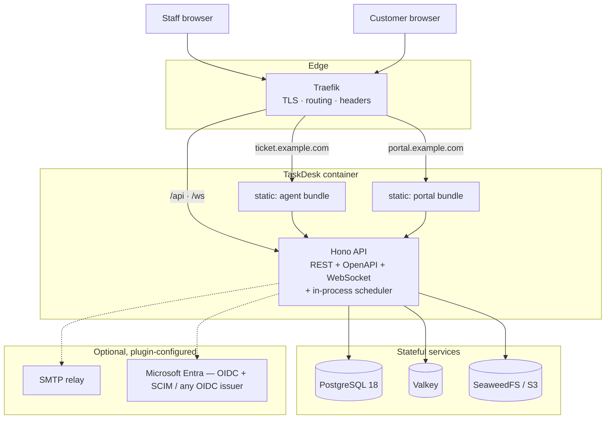

# Architecture overview

## Shape

One backend. One frontend codebase producing two bundles. Everything else is a
supporting service.



## Why one backend

v1 ran a .NET core-api, a Node BFF and a Go worker. Three languages, three deploy
artefacts, three dependency trees, three sets of auth plumbing between them — and the
BFF existed only to hold session secrets and aggregate views.

In v2:

- **The BFF disappears.** Hono *is* the backend-for-frontend. It holds the session, calls
  the database directly, and shapes responses for the UI.
- **The worker disappears.** kaneo's API already carries `croner` for scheduling and a
  `job_lease` table for distributed locking. SLA scanning, reminders, snapshot
  computation and webhook delivery become in-process scheduled jobs that are safe to run
  on multiple replicas.
- **One language.** TypeScript end to end, with types shared between server and client
  through the Hono client in `packages/libs`.

Full reasoning: [ADR 0002](adr/0002-single-backend.md).

## Layers

```
┌────────────────────────────────────────────────────────────┐
│ apps/web — React 19, TanStack Router + Query, Tailwind v4  │
│   entry.agent.tsx          entry.portal.tsx                │
│   route tree: /agent/*     route tree: /portal/*           │
│                    ↓ both import ↓                         │
│              packages/ui  (the only primitives)            │
└────────────────────────────────────────────────────────────┘
                      ↕ typed Hono client (packages/libs)
┌────────────────────────────────────────────────────────────┐
│ apps/api — Hono                                             │
│  ┌──────────────────────────────────────────────────────┐  │
│  │ transport   routes · zod-openapi · WebSocket · cron   │  │
│  ├──────────────────────────────────────────────────────┤  │
│  │ policy      packages/permissions — every route gated  │  │
│  ├──────────────────────────────────────────────────────┤  │
│  │ domain      packages/domain — SLA, workflow,          │  │
│  │             approvals, assignment, calendars.         │  │
│  │             Pure functions. No I/O. Heavily tested.    │  │
│  ├──────────────────────────────────────────────────────┤  │
│  │ plugins     auth · storage · notify · import          │  │
│  │             registries, configured at runtime          │  │
│  ├──────────────────────────────────────────────────────┤  │
│  │ data        Drizzle ORM → PostgreSQL                   │  │
│  └──────────────────────────────────────────────────────┘  │
└────────────────────────────────────────────────────────────┘
```

**The domain layer is the point.** SLA calculation, workflow transition legality,
approval gating and assignment rules are pure functions over plain data. They do no I/O,
so they are trivially unit-testable — which matters, because they encode the rules the
business actually cares about and they are where v1's real value lived.

## Request lifecycle

1. Traefik terminates TLS, applies security headers, routes by hostname.
2. Hono resolves the session cookie → `userId`.
3. **Portal boundary check** — a customer session on the agent origin is rejected outright.
4. **Identity resolution** — `userId` → directory record → side, organisation,
   memberships. *Never* read from token claims. See [RBAC](rbac.md).
5. **Policy check** — the route's declared capability is evaluated against the resolved
   reach and authority. Out of reach ⇒ `404`. In reach, insufficient authority ⇒ `403`.
6. Handler validates input with Zod, calls domain functions, persists via Drizzle.
7. **In the same transaction** as the change: the `activity` row, the `audit_log` row
   where the action is security-relevant, and the `outbox` row carrying the domain event
   ([events.md](events.md)).
8. **After commit**, from the commit hook — never from the handler body: WebSocket
   broadcast and in-app notification. Webhooks and email drain from the outbox. A rollback
   therefore never produces a phantom update.
9. Response, shaped by an explicit response schema. No ORM entities leak to the wire.

## Realtime

WebSockets at `/ws`, using kaneo's adapter pattern: in-memory for single-instance,
Valkey pub/sub for multi-instance. Clients subscribe per project and per user. Every
mutation broadcasts, so two people on the same board see each other's changes.

Detail: [Realtime](realtime.md).

## Background work

In-process, `croner`-scheduled, guarded by the `job_lease` table so only one replica runs
a given job.

The job list — names, cadences, lease TTLs — lives in exactly one place:
[Background jobs](background-jobs.md). Job names are identifiers (`job_lease.name`,
Prometheus labels) and are deliberately not restated here.

## Data

PostgreSQL 18 only. No secondary datastore for primary data.

- **Valkey** is a cache and a pub/sub bus. Losing it degrades performance, never data.
- **SeaweedFS/S3** holds attachment bytes; metadata stays in Postgres.
- Migrations are Drizzle-generated SQL, forward-only, applied at boot.

Detail: [Data model](data-model.md).

## Two portals, two origins, one codebase

`ticket.<domain>` serves the agent bundle; `portal.<domain>` serves the customer bundle.
Separate cookies, separate route trees, separate identity provider bindings — but **one
`apps/web` source tree and one shared `packages/ui`**.

This preserves v1's information-disclosure benefit (internal route names, admin labels
and staff feature names never ship to a customer browser) without v1's mistake of
maintaining two divergent UI codebases.

The bundle split is **not** the security boundary. The security boundary is server-side
policy. See [Security model](security-model.md) and
[ADR 0004](adr/0004-two-portals-two-origins.md).

## Everything pluggable

No customer-specific code paths. Identity providers, storage backends, notification
channels, importers and feature toggles are all runtime configuration edited in God Mode.
One image, any customer.

Detail: [Plugin architecture](plugin-architecture.md).

## What we deliberately do not do

| Not doing | Why |
| --- | --- |
| Microservices | One backend is enough at our scale; v1 proved the cost |
| GraphQL | REST + OpenAPI + a typed client already gives end-to-end types |
| Event sourcing | Audit journal gives point-in-time reconstruction without the complexity |
| Separate admin SPA | God Mode is a capability-gated route group in the agent app |
| Kubernetes as the primary target | Docker Compose behind Traefik is the supported path; a Helm chart exists but is secondary |
| Offline / local-first | Out of scope |

## Related

- [Tech stack](tech-stack.md) · [Monorepo layout](monorepo-layout.md)
- [Auth and identity](auth-and-identity.md) · [RBAC](rbac.md) · [Multi-tenancy](multi-tenancy.md)
- [ADR index](adr/README.md)
